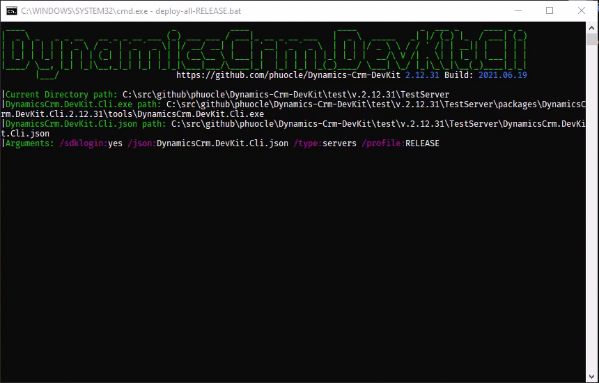
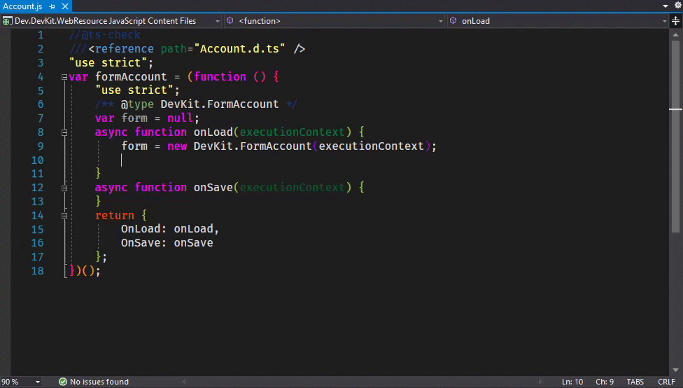
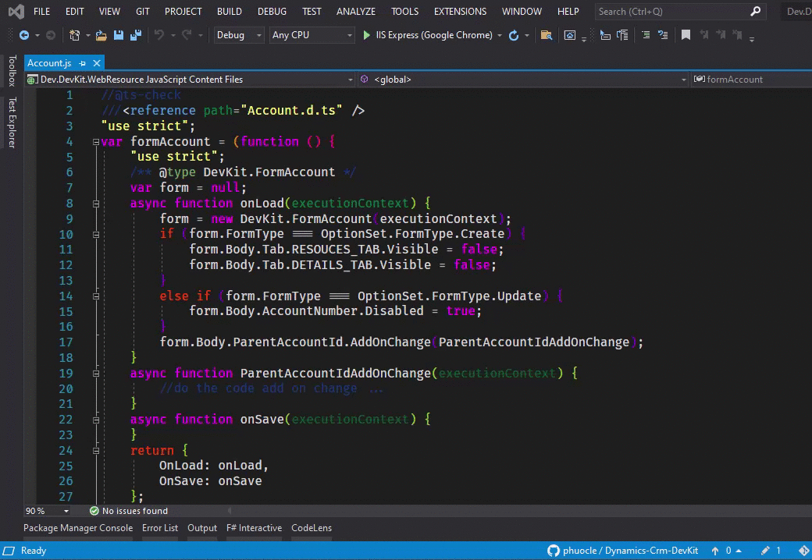
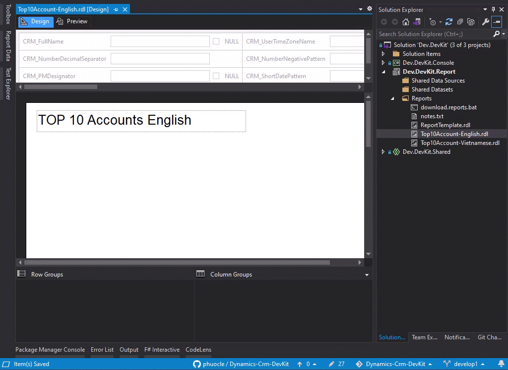

# 🚀 DynamicsCrm.DevKit

DynamicsCrm.DevKit is an integrated development toolkit for Microsoft Dataverse, Dynamics 365, and Power Platform engineering. It combines a Visual Studio extension, project and item templates, one-click deployment workflows, a .NET global CLI, an MCP server for AI-assisted Dataverse operations, and Roslyn analyzers for production-grade server-side code.

[](https://marketplace.visualstudio.com/items?itemName=PhuocLe.DynamicsCrmDevKit)
[](https://marketplace.visualstudio.com/items?itemName=PhuocLe.DynamicsCrmDevKit)
[](https://marketplace.visualstudio.com/items?itemName=PhuocLe.DynamicsCrmDevKit)
[](https://www.nuget.org/packages/DynamicsCrm.DevKit.Cli)
[](https://www.nuget.org/packages/DynamicsCrm.DevKit.Analyzers)
[](https://www.nuget.org/packages/DynamicsCrm.DevKit.Tool)

## ✨ Highlights

- Visual Studio extension for Dataverse projects, with 13 project templates and 16 item templates.
- One-click deployment from Visual Studio for server assemblies, plugin packages, web resources, TypeScript web resources, and reports.
- `devkit` CLI for repeatable deployment, code generation, solution packaging, report operations, web resource operations, and MCP hosting.
- MCP server with 32 active Dataverse tools across `basic`, `standard`, and `advanced` tiers for AI-assisted inspection, CRUD, metadata, forms, views, ribbon, apps, security, audit, plugins, workflows, and Web API scenarios.
- Roslyn analyzer package with 21 diagnostics, `DEVKIT1001` through `DEVKIT1021`, focused on Dataverse plugin, workflow, data provider, and integration safety.
- TypeScript and JavaScript client scaffolding for form scripts, Web API modules, dialog scripts, generated typings, and deployable web resources.

## 📦 Install

| Component | Install |
|---|---|
| Visual Studio extension | [Download from Visual Studio Marketplace](https://marketplace.visualstudio.com/items?itemName=PhuocLe.DynamicsCrmDevKit) |
| CLI global tool | `dotnet tool install -g DynamicsCrm.DevKit.Cli` |
| Companion global tool | `dotnet tool install -g DynamicsCrm.DevKit.Tool` |
| Roslyn analyzers | `<PackageReference Include="DynamicsCrm.DevKit.Analyzers" Version="*" PrivateAssets="all" />` |

## 📚 Component README

| Component | README |
|---|---|
| Visual Studio extension | [Visual Studio extension README](v5/DynamicsCrm.DevKit/README.md) |
| CLI and MCP server | [CLI README](v5/DynamicsCrm.DevKit.Cli/README.md) |
| Roslyn analyzers | [Analyzers README](v5/DynamicsCrm.DevKit.Analyzers/README.md) |
| Companion tool | [Tool README](v5/DynamicsCrm.DevKit.Tool/README.md) |

## 🧩 What Is Included

| Area | Current capability |
|---|---|
| Visual Studio extension | Project templates, item templates, wizards, context-menu commands, and editor commands for Dataverse development. |
| CLI | `generator`, `server`, `webresource`, `modelbuilder`, `solution`, `downloadreport`, `uploadreport`, `downloadwebresource`, `datasource`, `mcp`, and compatibility commands for older task names. |
| MCP server | Stdio MCP host with tool-category loading, setup guide output, tool listing, and dry-run mode for read-first workflows. |
| Code generation | JavaScript form, TypeScript form, JavaScript Web API, TypeScript Web API, C# late-bound classes, and PAC modelbuilder-backed early-bound classes. |
| Deployment | Server assemblies, plugin packages, managed identity metadata, web resources, compiled TypeScript web resources, reports, and solution pack/unpack automation. |
| Analyzers | Compile-time diagnostics for filtering attributes, plugin images, stateless plugins, parallel execution, HTTP calls, tracing, file IO, data providers, and common Dataverse runtime risks. |

## 🖥️ Visual Studio Workflows

### 🚀 Deploy server projects

Deploy plugins, workflows, custom actions, custom APIs, and data providers from Visual Studio.



### 🧠 Form IntelliSense

Generate client-side form helpers and work with typed form APIs directly in the editor.



### 🌐 Deploy web resources

Deploy JavaScript, TypeScript output, HTML, CSS, images, XML, RESX, SVG, and related Dataverse web resource files.



### 📊 Deploy reports

Upload and download Dataverse SSRS report definitions from the development project.



## 🧱 Project Templates

The template names below match the display names shown by Visual Studio.

| Visual Studio display name | Purpose | Wiki |
|---|---|---|
| 01. Shared Project | Shared Dataverse code, generated entity helpers, and reusable project items. | [Shared Project Template](https://github.com/phuocle/Dynamics-Crm-DevKit/wiki/Shared-Project-Template) |
| 02. Console Project | .NET Framework console utility project for Dataverse operations. | [Console Project Template](https://github.com/phuocle/Dynamics-Crm-DevKit/wiki/Console-Project-Template) |
| 03. Console Core Project | .NET console utility project using `Microsoft.PowerPlatform.Dataverse.Client`. | [Console Core Project Template](https://github.com/phuocle/Dynamics-Crm-DevKit/wiki/Console-Core-Project-Template) |
| 04. Server Project | Plugins, workflows, custom actions, custom APIs, and data providers. | [Server Project Template](https://github.com/phuocle/Dynamics-Crm-DevKit/wiki/Server-Project-Template) |
| 05. Package Project | Dataverse plugin package project with NuGet dependency support. | [Package Project Template](https://github.com/phuocle/Dynamics-Crm-DevKit/wiki/Package-Project-Template) |
| 06. WebResource Project | JavaScript, HTML, CSS, image, resource, and helper web resources. | [WebResource Project Template](https://github.com/phuocle/Dynamics-Crm-DevKit/wiki/WebResource-Project-Template) |
| 07. Shared Test Project | Shared test support project with Dataverse test helpers. | [Shared Test Project Template](https://github.com/phuocle/Dynamics-Crm-DevKit/wiki/Shared-Test-Project-Template) |
| 08. ProxyTypes Project | Early-bound proxy type generation project. | [ProxyTypes Project Template](https://github.com/phuocle/Dynamics-Crm-DevKit/wiki/ProxyTypes-Project-Template) |
| 09. Test Project | Unit test project for Dataverse server-side code. | [Test Project Template](https://github.com/phuocle/Dynamics-Crm-DevKit/wiki/Test-Project-Template) |
| 10. Ui Test Project | UI automation project using Dataverse UI test patterns. | [Ui Test Project Template](https://github.com/phuocle/Dynamics-Crm-DevKit/wiki/Ui-Test-Project-Template) |
| 11. Solution Packager Project | Dataverse solution extract/pack automation. | [Solution Packager Project Template](https://github.com/phuocle/Dynamics-Crm-DevKit/wiki/Solution-Packager-Project-Template) |
| 12. Report Project | Dataverse SSRS report project. | [Report Project Template](https://github.com/phuocle/Dynamics-Crm-DevKit/wiki/Report-Project-Template) |
| 13. WebResource TypeScript Project | TypeScript web resource project with generated typings and build output. | [WebResource TypeScript Project Template](https://github.com/phuocle/Dynamics-Crm-DevKit/wiki/WebResource-TypeScript-Project-Template) |

Project template catalog: [Projects Template](https://github.com/phuocle/Dynamics-Crm-DevKit/wiki/Projects-Template)

## 🧩 Item Templates

The item template names below match the display names shown by Visual Studio.

| Visual Studio display name | Purpose | Wiki |
|---|---|---|
| 01. C# Late Bound Class | Late-bound Dataverse entity class scaffold. | [CSharp Late Bound Class Item Template](https://github.com/phuocle/Dynamics-Crm-DevKit/wiki/CSharp-Late-Bound-Class-Item-Template) |
| 02. Javascript Form | JavaScript form script, typings, and form helper file. | [JavaScript Form Item Template](https://github.com/phuocle/Dynamics-Crm-DevKit/wiki/JavaScript-Form-Item-Template) |
| 03. Javascript WebApi | JavaScript Web API script, typings, and Web API helper file. | [JavaScript WebApi Item Template](https://github.com/phuocle/Dynamics-Crm-DevKit/wiki/JavaScript-WebApi-Item-Template) |
| 04. C# Plugin Class | Dataverse `IPlugin` class scaffold. | [CSharp Plugin Item Template](https://github.com/phuocle/Dynamics-Crm-DevKit/wiki/CSharp-Plugin-Item-Template) |
| 05. C# Custom Action Class | Custom action handler scaffold. | [CSharp Custom Action Item Template](https://github.com/phuocle/Dynamics-Crm-DevKit/wiki/CSharp-Custom-Action-Item-Template) |
| 06. C# Custom Api Class | Custom API handler scaffold. | [CSharp Custom Api Item Template](https://github.com/phuocle/Dynamics-Crm-DevKit/wiki/CSharp-Custom-Api-Item-Template) |
| 07. C# Workflow Class | Custom workflow activity scaffold. | [CSharp Workflow Item Template](https://github.com/phuocle/Dynamics-Crm-DevKit/wiki/CSharp-Workflow-Item-Template) |
| 08. C# Data Provider Class | Virtual table data provider operations: retrieve, retrieve multiple, create, update, delete. | [CSharp Data Provider Item Template](https://github.com/phuocle/Dynamics-Crm-DevKit/wiki/CSharp-Data-Provider-Item-Template) |
| 09. C# Test Class | Server-side unit test scaffold. | [CSharp Test Item Template](https://github.com/phuocle/Dynamics-Crm-DevKit/wiki/CSharp-Test-Item-Template) |
| 10. C# Ui Test Class | UI automation test scaffold. | [CSharp Ui Test Item Template](https://github.com/phuocle/Dynamics-Crm-DevKit/wiki/CSharp-Ui-Test-Item-Template) |
| 11. Resource String | Dataverse localization resource file. | [Resource String Item Template](https://github.com/phuocle/Dynamics-Crm-DevKit/wiki/Resource-String-Item-Template) |
| 12. DevKit files | DevKit support files, batch files, helpers, and managed identity setup files. | [Bat File Item Template](https://github.com/phuocle/Dynamics-Crm-DevKit/wiki/Bat-File-Item-Template) |
| 13. TypeScript Form | TypeScript form script with generated form typings. | [TypeScript Form Item Template](https://github.com/phuocle/Dynamics-Crm-DevKit/wiki/TypeScript-Form-Item-Template) |
| 14. TypeScript WebApi | TypeScript Web API script with typed interfaces. | [TypeScript WebApi Item Template](https://github.com/phuocle/Dynamics-Crm-DevKit/wiki/TypeScript-WebApi-Item-Template) |
| 15. TypeScript Dialog | TypeScript dialog script with typed dialog interfaces. | [TypeScript Dialog Item Template](https://github.com/phuocle/Dynamics-Crm-DevKit/wiki/TypeScript-Dialog-Item-Template) |
| 16. JavaScript Dialog | JavaScript dialog script with typed dialog interfaces. | [JavaScript Dialog Item Template](https://github.com/phuocle/Dynamics-Crm-DevKit/wiki/JavaScript-Dialog-Item-Template) |

Item template catalog: [Items Template](https://github.com/phuocle/Dynamics-Crm-DevKit/wiki/Items-Template)

## ⚙️ CLI

`DynamicsCrm.DevKit.Cli` is distributed as the `devkit` .NET global tool. It accepts modern `--option` arguments and keeps compatibility with older `/option:value` style arguments.

```powershell
devkit server --conn "AuthType=OAuth;..." --json "DynamicsCrm.DevKit.Cli.json" --profile default
devkit webresource --conn "AuthType=OAuth;..." --file ".\js\account.js" --webresource "new_/js/account.js"
devkit generator --conn "AuthType=OAuth;..." --json "DynamicsCrm.DevKit.Cli.json" --profile default
devkit solution --conn "AuthType=OAuth;..." --json "DynamicsCrm.DevKit.Cli.json" --profile default
devkit mcp --conn "AuthType=OAuth;..." --category standard
```

Authentication can be supplied through `--conn`, explicit `--auth` options, PAC profile, client secret credentials, or `DEVKIT_*` environment variables.

## 🤖 MCP Server

The CLI includes an MCP server for Dataverse-aware AI agents.

| Category | Tool count | Typical use |
|---|---:|---|
| `basic` | 9 | WhoAmI, table discovery, choices, records, FetchXML, search, demo data, URL parsing. |
| `standard` | 26 | Forms, views, roles, workflows, flows, BPFs, business rules, custom APIs, audit, plugins, trace logs, system jobs, web resources. |
| `advanced` | 32 | Model-driven apps, table and column metadata, relationships, raw Web API, and classic ribbon operations. |

Useful entry points:

```powershell
devkit mcp --setup-guide
devkit mcp --tools
devkit mcp --category basic --dry-run
devkit mcp "DevKit Dataverse" --category advanced
```

## 🛡️ Code Quality

`DynamicsCrm.DevKit.Analyzers` adds Dataverse-specific Roslyn diagnostics to C# projects. The rule set covers high-impact issues such as missing filtering attributes, unsafe `ColumnSet(true)`, invalid plugin images, stateful plugin instances, parallel execution, HTTP timeout configuration, invalid exception patterns, file IO in sandboxed code, data provider setup, and tracing gaps.

## 🔗 Project Links

- [GitHub Wiki](https://github.com/phuocle/Dynamics-Crm-DevKit/wiki)
- [Visual Studio Marketplace](https://marketplace.visualstudio.com/items?itemName=PhuocLe.DynamicsCrmDevKit)
- [NuGet: DynamicsCrm.DevKit.Cli](https://www.nuget.org/packages/DynamicsCrm.DevKit.Cli)
- [NuGet: DynamicsCrm.DevKit.Analyzers](https://www.nuget.org/packages/DynamicsCrm.DevKit.Analyzers)
- [NuGet: DynamicsCrm.DevKit.Tool](https://www.nuget.org/packages/DynamicsCrm.DevKit.Tool)

## 📄 License

This project is licensed under the terms specified in [LICENSE](LICENSE).
