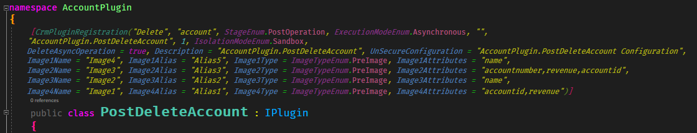
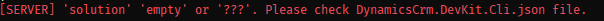
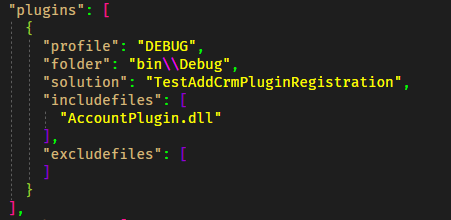
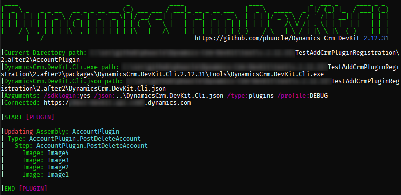
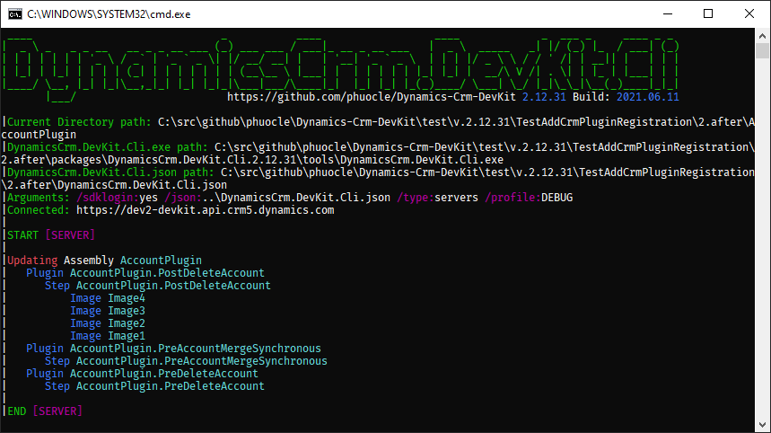
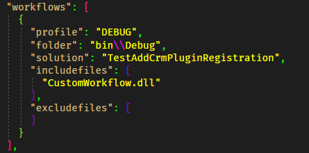
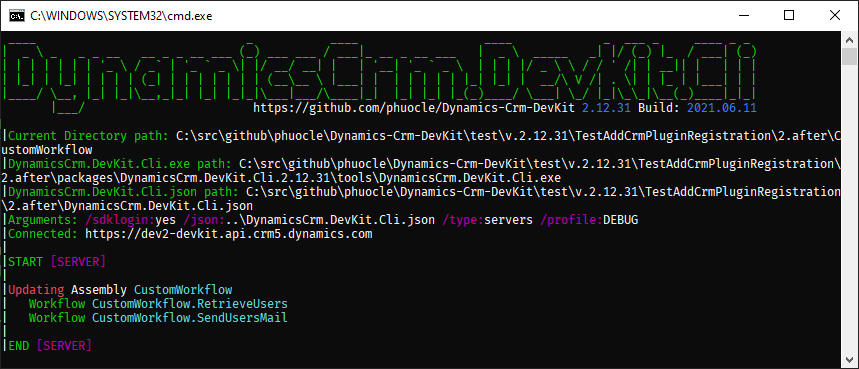

# 1. Import **TestAddCrmPluginRegistration** solution
From folder **0.solution**, import solution: **TestAddCrmPluginRegistration_1_0_0_0.zip** to your CDS dev.

>Note: this is the **unmanaged** solution

The imported solution contains:

* Plugin **AccountPlugin** and with these register steps
  * AccountPlugin.PostDeleteAccount
  * AccountPlugin.PreAccountMergeSynchronous
  * AccountPlugin.PreDeleteAccount PRE VALIDATION
* Workflow **CustomWorkflow** with these workflows
  * RetrieveUsers
  * SendUsersMail

# 2. Folder **1.before**
This is the full source code of the solution **TestAddCrmPluginRegistration_1_0_0_0.zip** we use this source code to work with **DynamicsCrm.DevKit**

# 3. Convert solution to work with **DynamicsCrm.DevKit**

1. Copy the folder **1.before** to the same directory and rename to **2.after**
2. Open the soltuion **SunFlower** with Visual Studio and Rebuild with all succeeded
3. Open file **PostDeleteAccount.cs** then right click in Visual Studio and select **Add CrmPluginRegistration** and you get the error\

4. Add **DynamicsCrm.DevKit Shared Project** to the solution
5. Continue **Add CrmPluginRegistration** and you get another error if you not add reference **DynamicsCrm.DevKit Shared Project** to **AccountPlugin**\

6. Continue **Add CrmPluginRegistration** and you get another error request you install **DynamicsCrm.DevKit.Cli** from NuGet, please find and install it.\

6. Continue **Add CrmPluginRegistration** and you get request to sign-in to Dynamics CRM/CDS\

7. **DynamicsCrm.DevKit.Cli** check with your current Dynamics CRM/CDS connection, and found the plugin **AccountPlugin.PostDeleteAccount**, then addadd the attribute class **CrmPluginRegistration** to make the plugin step can update and deploy\

> Please check **CrmPluginRegistration** help page to config the plugin step
8. Build solution and run the file **deploy.debug.bat** and you get the error\

9. Check the current solution folder and you see there 2 new files **DynamicsCrm.DevKit.Cli.json** and **DynamicsCrm.DevKit.js** and add it as the existing files to your project
10. Open **DynamicsCrm.DevKit.Cli.json** and update the section **plugins**\

11. Build your solution and run **deploy.debug.bat** again and you will now see the **DynamicsCrm.DevKit** deploy your plugin to your connected CRM/CDS\

12. Continue **Add CrmPluginRegistration** with step: **AccountPlugin.PostUpdateAccount** and you get the error\
\
This step you should manually add **CrmPluginRegistration** to the class attribute (please check the docs) or try to register this step by **Plugin Registration tool** and try **Add CrmPluginRegistration** again
12. Continue use **Add CrmPluginRegistration** with these step:
* AccountPlugin.PreAccountMergeSynchronous
* AccountPlugin.PreDeleteAccount
13. Now, all steps you convert to use and deploy with **DynamicsCrm.DevKit**
>When you right-click on classes **PreCreateAccount** or **PreUpdateAccount** you **not** see the menu **Add CrmPluginRegistration** because the class have Visual Studio setting **Build Action = None**
14. Now, deploy again and you will see the result\

15. Continue working the same with the **CustomWorkflow** project with the **DynamicsCrm.DevKit.Cli.json** section **workflows**\

16. Then run **deploy.debug.bat** to deploy\

17. **Congratulations** you converted all your plugin/workflow steps to work with **DynamicsCrm.DevKit** by run the **.bat** file