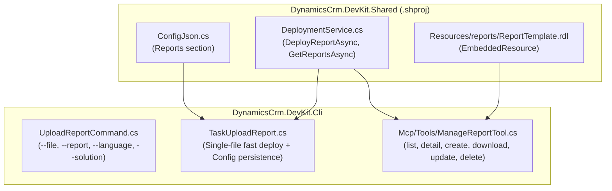

# MCP Tool `manage_report` & CLI Fast Deploy — Nghiên cứu & Đề xuất

Ngày: 2026-08-28 · Trạng thái: **NGHIÊN CỨU & ĐỀ XUẤT (MCP + CLI FAST DEPLOY) — CHỜ DUYỆT — CHƯA CODE**

---

## 1. Tổng quan nghiên cứu

### 1.1 Report trong Dataverse

Dataverse lưu SSRS reports trong entity **`report`** với solution component type **31**.

| Attribute | Type | Mô tả |
|---|---|---|
| `reportid` | `Guid` (PK) | ID duy nhất |
| `name` | `string` | Display name (vd: `Account Overview`) |
| `filename` | `string` | Tên file (vd: `AccountOverview.rdl`) |
| `bodytext` | `string` | **Raw RDL XML content** — định nghĩa SSRS report |
| `description` | `string` | Mô tả report |
| `reporttypecode` | `OptionSetValue` | 1=ReportingServices, 2=Other, 3=LinkedReport |
| `languagecode` | `int` | LCID (vd: `1033` = English) |
| `ismanaged` | `bool` | Managed hay không |
| `iscustomizable` | `BooleanManagedProperty` | Có cho phép customize không |
| `ispersonal` | `bool` | Personal report (user) hay Organization report |
| `createdon` | `DateTime` | Ngày tạo |
| `createdby` | `EntityReference` | Người tạo |
| `modifiedon` | `DateTime` | Ngày sửa |
| `modifiedby` | `EntityReference` | Người sửa |

**Khác biệt quan trọng so với WebResource:**
- Report **KHÔNG cần** `PublishXmlRequest` sau khi create/update (update `bodytext` có hiệu lực ngay lập tức)
- Report content là **plain text XML** (không base64 encode như WebResource `content`)
- Report có `languagecode` + join `languagelocale` để lấy tên ngôn ngữ
- Report có `filename` riêng biệt với `name` (WebResource chỉ có `name`)
- Report có `reporttypecode` thay vì `webresourcetype`
- Solution component type: **31** (WebResource là **61**)

---

### 1.2 Hiện trạng code liên quan đến Report

#### VSIX (VS 2022/2026)
- **Project Template**: `12.ReportProjectTemplate` — tạo `.rptproj` với sample `ReportTemplate.rdl`
- **Batch scripts**: `download.reports.bat` và `upload.reports.bat` delegate deploy qua CLI
- File: [`Report.cs`](file:///d:/github/Dynamics-Crm-DevKit/v5/DynamicsCrm.DevKit/Wizard/ProjectTemplates/Report.cs)

#### VSIX 2019
- **Upload Report**: Right-click context menu trên `.rdl` → [`UploadReportCommand.cs`](file:///d:/github/Dynamics-Crm-DevKit/v5/DynamicsCrm.DevKit.2019/UploadReportCommand.cs)
- **Report Mapping GUI**: [`FormReportMapping.xaml.cs`](file:///d:/github/Dynamics-Crm-DevKit/v5/DynamicsCrm.DevKit.2019/FormReportMapping.xaml.cs) — map local `.rdl` ↔ Dataverse `report` record
- **Config Helper**: [`ReportConfigHelper.cs`](file:///d:/github/Dynamics-Crm-DevKit/v5/DynamicsCrm.DevKit.2019/ReportConfigHelper.cs) — đọc/ghi mapping vào `DynamicsCrm.DevKit.Config.json`

#### CLI
| Command | File | Mô tả |
|---|---|---|
| `devkit downloadreport` | [`TaskDownloadReport.cs`](file:///d:/github/Dynamics-Crm-DevKit/v5/DynamicsCrm.DevKit.Cli/Tasks/TaskDownloadReport.cs) | Download reports từ solution → `{solution}/{language}/{filename}` |
| `devkit uploadreport` | [`TaskUploadReport.cs`](file:///d:/github/Dynamics-Crm-DevKit/v5/DynamicsCrm.DevKit.Cli/Tasks/TaskUploadReport.cs) | Upload `.rdl` files theo profile, diff detection qua `Helper.IsTheSame()` |

#### Shared
| File | Mô tả |
|---|---|
| [`DeployReport.cs`](file:///d:/github/Dynamics-Crm-DevKit/v5/DynamicsCrm.DevKit.Shared/Models/DeployReport.cs) | Model: File, ReportId, ReportName, ReportFileName, LanguageCode, Language, IsManaged |
| [`DeploymentService.cs`](file:///d:/github/Dynamics-Crm-DevKit/v5/DynamicsCrm.DevKit.Shared/Services/DeploymentService.cs) | `GetReportsBySolutionAsync(solution)` và `DeployReportAsync(reportId, fullFileName)` |
| [`ConfigJson.cs`](file:///d:/github/Dynamics-Crm-DevKit/v5/DynamicsCrm.DevKit.Shared/Models/ConfigJson.cs) | Chứa sẵn `public List<DeployReport> Reports { get; set; }` |
| [`JsonDownloadReport.cs`](file:///d:/github/Dynamics-Crm-DevKit/v5/DynamicsCrm.DevKit.Shared/Models/JsonDownloadReport.cs) | Config: `{ profile, solution }` |
| [`JsonUploadReport.cs`](file:///d:/github/Dynamics-Crm-DevKit/v5/DynamicsCrm.DevKit.Shared/Models/JsonUploadReport.cs) | Config: `{ profile, solution, languages[] }` |

---

### 1.3 Phân tích `ReportTemplate.rdl` — Embedded Resource Status

**Kiểm tra hiện trạng:**
1. File `ReportTemplate.rdl` hiện có trong `ProjectTemplates/CSharp/12.ReportProjectTemplate/ReportTemplate.rdl` (493 dòng XML).
2. Trong `DynamicsCrm.DevKit.Shared.projitems`, chỉ có `ReportProjectTemplate.rptproj` được khai báo là `<EmbeddedResource>`, **chưa có `ReportTemplate.rdl`**.
3. **Kết luận**: `ReportTemplate.rdl` hiện tại **CHƯA PHẢI là embedded resource** trong `DynamicsCrm.DevKit.Shared`.

**Giải pháp đề xuất:**
1. Thêm `ReportTemplate.rdl` vào `DynamicsCrm.DevKit.Shared/Resources/reports/ReportTemplate.rdl`.
2. Khai báo trong `DynamicsCrm.DevKit.Shared.projitems`:
   ```xml
   <ItemGroup>
     <EmbeddedResource Include="$(MSBuildThisFileDirectory)Resources\reports\ReportTemplate.rdl" />
   </ItemGroup>
   ```
3. Cả **VSIX**, **CLI**, và **MCP Server** đều truy cập được qua `Helper.ReadEmbeddedResourceAsync()` hoặc `Helper.ReadEmbeddedResource()`.

---

## 2. Nghiên cứu CLI Fast Deploy cho Report (Tương tự `devkit webresource`)

### 2.1 Cơ chế Fast Deploy của `devkit webresource`

Trong `devkit webresource`:
- **Chế độ Profile (Batch)**: `devkit webresource --conn "..." --json "..." --profile "DEBUG"`
- **Chế độ Fast Deploy (Single File)**:
  ```bash
  devkit webresource --conn "..." --file "build/entities/Account.form.js" --webresource "new_/entities/Account.form.js"
  ```
  - `IsProfileRequired` và `IsJsonRequired` trả về `false` khi có `--file`.
  - Tự động bỏ qua việc parse `DynamicsCrm.DevKit.Cli.json`.
  - Tự động kiểm tra TypeScript (nếu là `.ts` thì build sang `.js`).
  - Kiểm tra diff, chỉ deploy khi nội dung thay đổi.
  - Tự động lưu mapping vào `DynamicsCrm.DevKit.Config.json` (`WebResources` section).

### 2.2 Hiện trạng của `devkit uploadreport` (Chưa có Fast Deploy)

Hiện tại, `devkit uploadreport` chỉ chạy ở chế độ Profile:
```bash
devkit uploadreport --conn "..." --json "DynamicsCrm.DevKit.Cli.json" --profile "DEBUG"
```
**Hạn chế:**
- Bắt buộc phải có file `DynamicsCrm.DevKit.Cli.json` và cấu hình `uploadreports`.
- Bắt buộc phải tổ chức thư mục theo cấu trúc `{solution}/{language}/*.rdl`.
- Không thể deploy nhanh 1 file `.rdl` đơn lẻ đang chỉnh sửa trong Visual Studio / VS Code.
- Không tự động lưu mapping vào `DynamicsCrm.DevKit.Config.json` (mặc dù `ConfigJson.cs` đã có sẵn property `Reports`).

### 2.3 Đề xuất: Bổ sung Fast Deploy cho `devkit uploadreport`

Cho phép cú pháp Fast Deploy linh hoạt:
```bash
# 1. Fast deploy 1 file cụ thể với tên report
devkit uploadreport --conn "..." --file "Reports/1033/AccountOverview.rdl" --report "Account Overview"

# 2. Fast deploy 1 file (tự động resolve report name theo tên file hoặc mapping trong Config.json)
devkit uploadreport --conn "..." --file "Reports/1033/AccountOverview.rdl"

# 3. Fast deploy kèm chỉ định ngôn ngữ và solution
devkit uploadreport --conn "..." --file "Reports/AccountOverview.rdl" --report "Account Overview" --language "English" --solution "CoreSolution"
```

**Chi tiết thiết kế Fast Deploy CLI:**

1. **`UploadReportCommandArgs.cs`** bổ sung các options:
   ```csharp
   [CommandOption("--file|-f")]
   [Description("Single .rdl report file to deploy")]
   public string File { get; set; }

   [CommandOption("--report|-r")]
   [Description("Name, filename, or GUID of the report in Dataverse")]
   public string Report { get; set; }

   [CommandOption("--language|-l")]
   [Description("Language name (e.g. 'English') or LCID (default: 1033)")]
   public string Language { get; set; }

   [CommandOption("--solution|-s")]
   [Description("Solution unique name (used if creating new report)")]
   public string Solution { get; set; }
   ```

2. **`UploadReportCommand.cs`**:
   - Override `IsProfileRequired` & `IsJsonRequired`: return `string.IsNullOrEmpty(settings.File)`.
   - Nếu có `--file`, tạo dummy `JsonUploadReport` và chuyển tiếp vào `TaskUploadReport`.

3. **`TaskUploadReport.cs` (Xử lý Fast Deploy)**:
   - Kiểm tra file local tồn tại.
   - **Phân giải report target trong Dataverse**:
     - Tra cứu trong `DynamicsCrm.DevKit.Config.json` (section `Reports`) theo đường dẫn file.
     - Nếu chưa có mapping: tìm kiếm trong Dataverse theo `--report` (hoặc lấy tên file `.rdl`) và ngôn ngữ.
   - Kiểm tra `ismanaged` + `iscustomizable` (chặn sửa managed).
   - So sánh diff `Helper.IsTheSame(localContent, remoteBodytext)`.
   - Nếu có diff: gọi `DeploymentService.DeployReportAsync(reportId, file)`.
   - Lưu/cập nhật mapping vào `DynamicsCrm.DevKit.Config.json` (section `Reports`).
   - Log rõ ràng: `[DEPLOYED]` hoặc `[DO_NOTHING]` (nếu giống nhau).

---

## 3. Đề xuất thiết kế MCP Tool `manage_report`

MCP Tool phục vụ cho các AI Agent (Copilot / Codex / Claude) quản lý vòng đời toàn diện:

### 3.1 6 Actions được hỗ trợ

| Action | Mô tả | ReadOnly | Mutation |
|---|---|---|---|
| `list` | Liệt kê reports, filter by name/filename/solution/language | ✅ | — |
| `detail` | Chi tiết 1 report: metadata + bodytext size + DataSources/DataSets summary | ✅ | — |
| `create` | Tạo report mới từ local `.rdl` HOẶC từ embedded `ReportTemplate.rdl`, add vào solution (type 31) | — | ✅ |
| `download` | Ghi bodytext vào temp file `.rdl` (hoặc target path), return file path | ✅ | — |
| `update` | Đọc local `.rdl` → diff check → update `bodytext` / `description` | — | ✅ |
| `delete` | Xóa report (unmanaged/customizable only) | — | ✅ |

### 3.2 Parameters

```text
action         : string : list / detail / create / download / update / delete. Required.
report_id      : string : GUID, Display Name (name), or filename. Required: detail/download/update/delete.
name           : string : Display Name (e.g. 'Account Summary'). Required: create. list: contains filter across name and filename.
filename       : string : Target .rdl filename (e.g. 'AccountSummary.rdl'). Optional: create.
solution_name  : string : Required: create (used to add report to solution). list: filter by solution.
file_path      : string : Absolute or relative path to local .rdl file.
                          - create: Optional (if omitted, uses embedded ReportTemplate.rdl).
                          - update: Required.
                          - download: Optional target directory/file (default: temp folder).
language       : string : Language name (e.g. 'English') or LCID (default: 1033).
description    : string : Description text. Optional: create/update.
entity_name    : string : Target entity logical name (e.g. 'account', 'contact'). Optional: create when generating from template.
max_records    : int    : list: 1-500, default 50.
```

---

## 4. Ma trận so sánh: VSIX vs CLI Fast Deploy vs MCP Tool

| Tính năng | VSIX (2022/2026) | VSIX 2019 | CLI `uploadreport` (Đề xuất) | MCP `manage_report` |
|---|---|---|---|---|
| **Mục đích sử dụng** | Dev trong IDE | Dev trong IDE (SSDT) | Command Line / CI-CD / Script | AI Agents / Chat Assistant |
| **Giao diện** | Context menu / Batch | Context menu + GUI modal | Terminal CLI (`--file`) | JSON RPC / Tool call |
| **Single-file Fast Deploy** | Gọi `.bat` → CLI | Có (Menu click) | **Có (`--file`)** | **Có (`update`)** |
| **Batch Deploy** | Có (qua `.bat`) | Không | Có (qua `--profile`) | Không (từng report) |
| **Create new report** | Project Template | Không | Có thể mở rộng | **Có (`create` + Template nhúng)** |
| **Download report** | Qua `.bat` | Không | Có (`downloadreport`) | **Có (`download`)** |
| **Config Persistence** | Có | Có (`Config.json`) | **Có (`Config.json`)** | Không (AI không lưu local config) |
| **Diff Detection** | Không | `string.Equals` | `Helper.IsTheSame` | `Helper.IsTheSame` |
| **Dry-Run Safety** | Không | Không | Không | **Có (`--dry-run`)** |

---

## 5. Kế hoạch triển khai tổng thể



---

## 6. Tham chiếu

- CLI WebResource Fast Deploy: [`WebResourceCommand.cs`](file:///d:/github/Dynamics-Crm-DevKit/v5/DynamicsCrm.DevKit.Cli/Commands/WebResourceCommand.cs), [`TaskWebResource.cs`](file:///d:/github/Dynamics-Crm-DevKit/v5/DynamicsCrm.DevKit.Cli/Tasks/TaskWebResource.cs)
- CLI Report Tasks: [`UploadReportCommand.cs`](file:///d:/github/Dynamics-Crm-DevKit/v5/DynamicsCrm.DevKit.Cli/Commands/UploadReportCommand.cs), [`TaskUploadReport.cs`](file:///d:/github/Dynamics-Crm-DevKit/v5/DynamicsCrm.DevKit.Cli/Tasks/TaskUploadReport.cs)
- Gap Analysis trước đó: [`WebResource-Report-Analysis.md`](file:///d:/github/Dynamics-Crm-DevKit/v5/DynamicsCrm.DevKit.Docs/Cli/WebResource-Report-Analysis.md)
