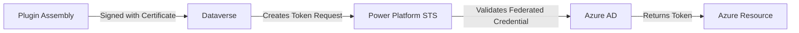

# Plugin Managed Identity - Quick Overview

> Last Updated: February 2026

## What is Plugin Managed Identity?

Power Platform Managed Identity allows Dataverse plugins to securely connect to Azure resources (like Key Vault, Storage, etc.) **without storing credentials**.

---

## Benefits

| Traditional Approach | Managed Identity |
|---------------------|------------------|
| Store client secrets in Dataverse | No credentials stored |
| Manual secret rotation | Azure handles rotation |
| Risk of credential exposure | Zero credential exposure |
| Complex configuration | Streamlined setup (after initial config) |

---

## Key Components



---

## Prerequisites

1. **Azure Subscription** - with permissions for:
   - App registrations
   - User-assigned managed identities (optional)
   - Key Vault (or target resource)

2. **Certificate** - for plugin signing:
   - Self-signed (development only)
   - CA-issued (production)

3. **Tools**:
   - Azure CLI (`az`)
   - Plugin Registration Tool
   - SignTool.exe
   - Power Platform CLI

---

## Configuration Overview

### 1. App Registration in Azure AD
- Create app registration
- Create service principal
- Configure Key Vault access policy

### 2. Federated Credential
- Format: `https://login.microsoftonline.com/{tenantID}/v2.0`
- Links plugin identity to Azure AD app

### 3. Certificate Signing
- Sign plugin DLL with certificate
- Certificate thumbprint is used in identity validation

### 4. Managed Identity Record in Dataverse
- Links app registration to plugin assembly
- Enables `IManagedIdentityService` in plugin code

---

## Script Usage

### Configuration file: `Plugin-Managed-Identity-Config.json`

```json
{
  "ResourceGroup": "YourResourceGroup",
  "Location": "southeastasia",
  "KeyVaultName": "YourKeyVault",
  "SecretName": "YourSecret",
  "SecretValue": "YourSecretValue",
  "CertificateFileName": "YourCert",
  "CertificatePassword": "YourPassword",
  "CertificateValidityYears": 10,
  "ManagedIdentities": [
    {
      "AppName": "YourAppName",
      "AppId": "",
      "EnvironmentId": "your-env-guid"
    }
  ]
}
```

### Run Script

```powershell
.\Plugin-Managed-Identity.ps1
```

---

## Related Documentation

- [RESEARCH-ANALYSIS.md](./RESEARCH-ANALYSIS.md) - Detailed comparison of OLD vs NEW formats
- [Microsoft Learn - Set up managed identity](https://learn.microsoft.com/en-us/power-platform/admin/set-up-managed-identity)
- [IManagedIdentityService API](https://learn.microsoft.com/en-us/dotnet/api/microsoft.xrm.sdk.imanagedidentityservice)
