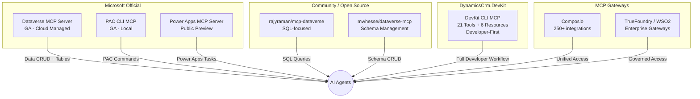

# DevKit CLI MCP Server — Comprehensive Analysis (March 2026)

> **Author**: Solution Architect — 20 years Dataverse/CRM (v4.0 → D365 Online)
> **Last Updated**: 2026-03-31
> **Scope**: DynamicsCrm.DevKit CLI MCP Server — 21 tools, 6 resources

---

## Table of Contents

1. [Executive Summary](#1-executive-summary)
2. [DevKit MCP Tool Inventory](#2-devkit-mcp-tool-inventory)
3. [Competitive Landscape (2025–2026)](#3-competitive-landscape-2025-2026)
4. [SWOT Analysis](#4-swot-analysis)
5. [Detailed Pros & Cons](#5-detailed-pros--cons)
6. [Critical Gaps — Missing Tools](#6-critical-gaps--missing-tools)
7. [Nice-to-Have Gaps — Secondary Priority](#7-nice-to-have-gaps--secondary-priority)
8. [Recommendations & Roadmap](#8-recommendations--roadmap)
9. [Appendix A — Tool Comparison Matrix](#appendix-a--tool-comparison-matrix)
10. [Appendix B — MCP Ecosystem Players](#appendix-b--mcp-ecosystem-players)

---

## 1. Executive Summary

The DevKit CLI MCP Server is one of the **most feature-rich, developer-centric** Dataverse MCP implementations in the ecosystem as of March 2026. With **21 tools** and **6 resources**, it covers a uniquely holistic set of developer operations that no single competitor matches — from metadata exploration (entities, attributes, relationships) through UI customization (forms, views with XSD validation + auto-backup) to operational debugging (plugin trace logs, security role audit).

### Key Differentiators

| Category | DevKit CLI MCP | Microsoft Official | Community Servers |
|----------|---------------|-------------------|-------------------|
| **Form Customization** | ✅ Full (build + update + undo + rename + XSD validation) | ❌ Not available | ❌ Not available |
| **View Customization** | ✅ Full (create + update + rename + sync validation) | ❌ Not available | ❌ Not available |
| **Safety Mechanisms** | ✅ Auto-backup, XSD validation, blocked endpoints, rollback | ❌ None | ⚠️ Minimal |
| **Plugin Debugging** | ✅ Full trace log inspection | ❌ Not available | ❌ Not available |
| **Security Role Audit** | ✅ User → Role → Privilege depth | ❌ Not available | ⚠️ Basic in mwhesse |
| **Schema Management** | ⚠️ Read-only (via execute_webapi) | ✅ create_table, describe | ✅ Full CRUD (mwhesse) |
| **FetchXML** | ✅ Full (auto-paging, aggregation) | ⚠️ SQL-based (read_query) | ⚠️ SQL-based |

### Bottom Line

DevKit excels at the **"inner loop" of Dynamics 365 development** — what a developer does 80% of the time: exploring metadata, customizing forms/views, debugging plugins, managing records, and inspecting solutions. However, it has notable gaps in **schema write operations** (creating tables, columns, relationships) and **ALM/environment management** that competitors are starting to address.

---

## 2. DevKit MCP Tool Inventory

### 2.1 Tools (21)

| # | Tool | Category | Read/Write | Maturity |
|---|------|----------|-----------|----------|
| 1 | `whoami` | Identity | Read | ⭐⭐⭐⭐⭐ |
| 2 | `get_entities_metadata` | Metadata | Read | ⭐⭐⭐⭐⭐ |
| 3 | `get_entity_metadata` | Metadata | Read | ⭐⭐⭐⭐⭐ |
| 4 | `get_messages` | Metadata | Read | ⭐⭐⭐⭐ |
| 5 | `get_global_optionsets` | Metadata | Read | ⭐⭐⭐⭐ |
| 6 | `get_record` | Data | Read | ⭐⭐⭐⭐⭐ |
| 7 | `upsert_record` | Data | Write | ⭐⭐⭐⭐⭐ |
| 8 | `delete_record` | Data | Write | ⭐⭐⭐⭐ |
| 9 | `execute_fetchxml` | Data | Read | ⭐⭐⭐⭐⭐ |
| 10 | `search` | Data | Read | ⭐⭐⭐⭐ |
| 11 | `execute_webapi` | Fallback | Read/Write | ⭐⭐⭐⭐⭐ |
| 12 | `get_forms` | UI/Forms | Read | ⭐⭐⭐⭐⭐ |
| 13 | `build_formxml` | UI/Forms | Read (builder) | ⭐⭐⭐⭐⭐ |
| 14 | `update_form` | UI/Forms | Write | ⭐⭐⭐⭐⭐ |
| 15 | `get_views` | UI/Views | Read | ⭐⭐⭐⭐⭐ |
| 16 | `update_view` | UI/Views | Write | ⭐⭐⭐⭐⭐ |
| 17 | `get_security_roles` | Security | Read | ⭐⭐⭐⭐⭐ |
| 18 | `get_solution_components` | ALM | Read | ⭐⭐⭐⭐ |
| 19 | `get_plugin_trace_logs` | Debugging | Read | ⭐⭐⭐⭐⭐ |
| 20 | `publish` | Operations | Write | ⭐⭐⭐⭐⭐ |
| 21 | `parse_record_url` | Utility | Read | ⭐⭐⭐⭐ |

### 2.2 Resources (6)

| # | URI | Type | Purpose |
|---|-----|------|---------|
| 1 | `schema://formxml` | XSD | FormXml.xsd — form structure validation |
| 2 | `schema://layoutxml` | XSD | LayoutXml.xsd — view column layout validation |
| 3 | `schema://fetchxml` | XSD | Fetch.xsd — query syntax reference |
| 4 | `schema://sitemapxml` | Markdown + XSD | SiteMap.xsd + SiteMapType.xsd + rules |
| 5 | `docs://instructions_for_formxml` | Markdown | FormXML manipulation rules & best practices |
| 6 | `docs://instructions_for_views` | Markdown | View/LayoutXML manipulation rules |

### 2.3 Architecture Highlights

```
McpServerHost.cs
├── .WithStdioServerTransport()     — Standard MCP stdio transport
├── .WithToolsFromAssembly()        — Auto-discovers [McpServerTool] attributes
├── .WithResourcesFromAssembly()    — Auto-discovers [McpServerResource] attributes
├── ServiceClient (DI singleton)    — Dataverse SDK connection
└── MetadataService (DI singleton)  — Cached metadata for entity resolution
```

**Key Design Decisions:**
- Uses `ServiceClient` (Dataverse SDK) rather than raw HTTP — benefits from SDK's retry, connection pooling, and token management
- Structured outputs via `OutputSchemaType` for MCP structured content protocol
- Helper classes: `CompactFormatter`, `MarkdownFormatter`, `DataverseValueFormatter`, `FetchXmlPagingHelper`

---

## 3. Competitive Landscape (2025–2026)

### 3.1 Microsoft Official — Dataverse MCP Server

**Status**: Generally Available (late 2025)
**Access**: Power Platform Admin Center → Settings → Product → Features

| Tool | Description |
|------|-------------|
| `list_tables` | List all tables in environment |
| `describe_table` | T-SQL schema of a table |
| `read_query` | Execute SELECT statements (T-SQL) |
| `create_record` | Insert a record |
| `update_record` | Update a record (by GUID) |
| `search` | Keyword search across tables |
| `fetch` | Get full record by entity + ID |
| `create_table` | Create new Dataverse tables |
| `delete_table` | Delete a Dataverse table |

**Strengths**: Native integration with Copilot Studio, managed by Microsoft, enterprise licensing included, respects RBAC/MFA, no local tools needed.

**Weaknesses**: No form/view customization, no plugin debugging, no security role inspection, no FetchXML support (SQL-only via `read_query`), no solution inspection, limited metadata depth.

### 3.2 Community — rajyraman/mcp-dataverse

**Status**: Open source (.NET tool)
**Focus**: SQL-based data access

| Tool | Description |
|------|-------------|
| Metadata for all tables | List tables with metadata |
| Table metadata | Individual table details |
| Field metadata | Column-level details |
| `GetRowsForTable` | Retrieve records from table |
| FetchXML → SQL converter | Query language translation |

**Strengths**: Simple setup, SQL interface familiar to data analysts, lightweight.

**Weaknesses**: Read-only data focus, no write operations, no UI customization, no debugging tools, limited scope.

### 3.3 Community — mwhesse/dataverse-mcp

**Status**: Open source, production-ready
**Focus**: Schema management + ALM

| Tool Category | Capabilities |
|--------------|-------------|
| Table Operations | Create, get, update, delete custom tables |
| Column Operations | Create all data types |
| Relationship Mgmt | 1:N and N:N management |
| Global Option Sets | Create, manage with options/values |
| Schema Export | JSON export + Mermaid ERD diagrams |
| Security Roles | Create, inspect roles and teams |
| Power Pages | WebAPI generators, site configs |
| Solution-based | Automatic prefix, solution context |

**Strengths**: Full schema CRUD, solution-aware, Power Pages integration, ERD visualization, natural language schema changes.

**Weaknesses**: No form/view customization, no plugin debugging, no FetchXML, no safety mechanisms (backup/validation), no record CRUD.

### 3.4 PAC CLI — Built-in MCP

**Status**: GA (via `pac copilot mcp --run`)
**Focus**: Developer CLI surface via natural language

Wraps existing PAC CLI commands (solution management, auth management, plugin registration) as MCP tools. Not focused on Dataverse data/metadata directly, but on the PAC CLI workflow itself.

---

## 4. SWOT Analysis

### Strengths 💪

1. **Unmatched Form/View Customization** — The `build_formxml` → `update_form` → `undo` workflow is unique in the entire ecosystem. No other MCP server provides:
   - Automatic classID resolution from metadata
   - XSD validation before write
   - Auto-backup with rollback path
   - Blocked endpoint protection
   - View FetchXML ↔ LayoutXML sync validation

2. **Developer-First Design** — Every tool is designed for the developer workflow:
   - `get_entity_metadata` returns ALL attributes, relationships, and picklist options in one call
   - `execute_fetchxml` supports auto-paging, aggregation, and returns markdown tables
   - `get_plugin_trace_logs` with browse → detail pattern saves tokens
   - `parse_record_url` handles all Dynamics 365 URL formats

3. **Safety Architecture** — Production-grade safety that no competitor has:
   - Blocked writes to `systemforms`, `savedqueries`, `userqueries`, `sitemaps` via `execute_webapi`
   - Forced backup before destructive operations
   - XSD schema validation against embedded schemas
   - Structured error responses with actionable tips

4. **Deep Metadata Intelligence** — Goes far beyond table/column listing:
   - Full attribute metadata with picklist options, constraints, required levels
   - 1:N, N:1, N:N relationships with correct from/to columns for FetchXML joins
   - SDK messages + Custom Actions + Custom APIs per entity
   - Solution component inspection with fuzzy name matching

5. **Security Audit Capability** — `get_security_roles` with user → role → privilege chain is invaluable for "access denied" debugging — a daily pain point in D365 projects.

6. **Rich Resource System** — XSD schemas and instruction documents guide the AI to produce correct FormXML/LayoutXML/FetchXML without hallucinating structures.

### Weaknesses 📉

1. **No Schema Write Operations** — Cannot create/modify tables, columns, or relationships without falling back to `execute_webapi` with raw JSON. This is a significant gap vs. mwhesse's implementation.

2. **No SiteMap Tool** — Despite having the SiteMap resource (schema://sitemapxml) and blocking SiteMap writes via `execute_webapi`, there is no dedicated `upsert_sitemap` tool. It's marked as "coming soon" in the codebase.

3. **Local-Only** — Requires local installation and ServiceClient auth. Cannot be used as a managed cloud service like Microsoft's official MCP server.

4. **Single Environment** — Connects to one Dataverse environment at a time. No cross-environment comparison or migration tooling.

5. **No Business Logic Tools** — Cannot inspect or manage business rules, workflows, Power Automate flows, or business process flows.

### Opportunities 🚀

1. **Schema management tools** (create_table, create_column, create_relationship) would close the biggest gap and make DevKit the most comprehensive MCP server available.

2. **SiteMap tool** would complete the UI customization trilogy (Forms → Views → SiteMap).

3. **Environment comparison** tools would be unique in the ecosystem and extremely valuable for ALM/migration scenarios.

4. **Power Pages integration** (following mwhesse's lead) could capture a growing market.

5. **Solution import/export** tools would bridge the gap to PAC CLI functionality directly within the MCP context.

### Threats ⚠️

1. **Microsoft's official MCP server** continues to expand. If Microsoft adds form/view/security tools, DevKit's unique advantages shrink.

2. **PAC CLI MCP** already wraps PAC commands — could expand to cover metadata/customization scenarios.

3. **Community servers** (especially mwhesse) are evolving rapidly with schema management and Power Pages features.

4. **MCP Gateway services** (Composio, TrueFoundry) are consolidating MCP access — could commoditize individual server implementations.

---

## 5. Detailed Pros & Cons

### ✅ Pros

| # | Pro | Impact | Competitors |
|---|-----|--------|------------|
| P1 | **Only MCP server with full FormXML lifecycle** (read → build → validate → write → undo) | 🔴 Critical — saves hours of manual form editing | None |
| P2 | **Only MCP server with view create/update/rename** with FetchXML ↔ LayoutXML sync validation | 🔴 Critical — prevents broken views in production | None |
| P3 | **Auto-backup before every destructive operation** with fail-safe (blocks update if backup fails) | 🔴 Critical — zero-risk customization changes | None |
| P4 | **Blocked endpoint pattern** prevents AI from accidentally destroying forms/views/sitemaps via raw WebAPI | 🟠 High — unique safety layer | None |
| P5 | **Plugin trace log inspection** with compact browse → detailed record pattern. AI can debug plugins without leaving the IDE | 🟠 High — accelerates debugging 10x | None |
| P6 | **Security role audit trail** (user email → roles → effective privileges per entity at all depth levels) | 🟠 High — solves "access denied" in 30 seconds | mwhesse (basic) |
| P7 | **XSD schema resources** guide AI to generate structurally valid FormXML/LayoutXML/FetchXML | 🟡 Medium — reduces hallucination errors | None |
| P8 | **FetchXML with auto-paging** up to 5000 records, supporting aggregation and subquery patterns | 🟡 Medium — superior to SQL-only approaches for Dataverse | rajyraman (SQL) |
| P9 | **Structured output** (OutputSchemaType) for every tool — enables downstream automation | 🟡 Medium — better than text-only responses | None |
| P10 | **Solution component inspection** with fuzzy name matching and full entity metadata for "Include All" components | 🟡 Medium — solution audit without maker portal | None |
| P11 | **Relevance Search integration** — search across multiple entities simultaneously | 🟢 Low — convenience feature | MS Official |
| P12 | **Upsert pattern** (merged create + update) reduces tool count for AI agents | 🟢 Low — ergonomic improvement | None |

### ❌ Cons

| # | Con | Impact | Who Does It Better |
|---|-----|--------|--------------------|
| C1 | **No schema CRUD** — cannot create tables, columns, or relationships via dedicated tools | 🔴 Critical gap — forces raw WebAPI calls | mwhesse (full), MS Official (tables) |
| C2 | **No SiteMap management** — blocked via WebAPI, no dedicated tool yet | 🟠 High gap — can't customize app navigation | None (all lack this) |
| C3 | **No relationship management** — cannot create/modify 1:N or N:N relationships | 🟠 High gap — schema definition incomplete | mwhesse |
| C4 | **Local install required** — not a cloud/managed service | 🟡 Medium — extra setup step | MS Official (cloud-native) |
| C5 | **Single environment scope** — no cross-env comparison or migration | 🟡 Medium — ALM limitation | None (all share this) |
| C6 | **No Business Rule/BPF inspection** — cannot read or modify business rules or business process flows | 🟡 Medium — customization gap | None (all share this) |
| C7 | **No Power Automate flow visibility** — cannot list or inspect cloud flows | 🟡 Medium — no automation debugging | None (all share this) |
| C8 | **No audit log inspection** — cannot query entity audit history | 🟡 Medium — compliance gap | None (all share this) |
| C9 | **No web resource management** — cannot upload/download/list web resources | 🟡 Medium — overlaps with CLI commands | None via MCP |
| C10 | **No environment variable management** — cannot CRUD environment variables | 🟢 Low — niche ALM need | None via MCP |

---

## 6. Critical Gaps — Missing Tools

These are **high-impact, high-demand** tools that a 20-year D365 architect would consider essential for a comprehensive developer MCP server.

### 🔴 Gap 1: Schema Management Tools (HIGHEST PRIORITY)

**Why Critical**: Creating and modifying the data model (tables, columns, relationships) is the foundation of EVERY Dynamics 365 project. Currently, a developer must fall back to `execute_webapi` with raw JSON payloads — error-prone and un-guided.

**Proposed Tools**:

| Tool | Description | Complexity |
|------|-------------|------------|
| `create_entity` | Create a new custom table (entity) in a solution | High |
| `create_attribute` | Add a column (text, number, lookup, optionset, datetime, etc.) | High |
| `create_relationship` | Create 1:N or N:N relationship between entities | Medium |
| `update_attribute` | Modify column properties (display name, required level, etc.) | Medium |
| `create_global_optionset` | Create a new global choice/picklist | Low |
| `update_global_optionset` | Add/remove/reorder options in an existing global optionset | Low |

**Why DevKit Should Own This**: The `build_formxml` tool already demonstrates DevKit's ability to resolve metadata (classIDs, attribute types) and generate correct XML structures. The same pattern applies to schema management — resolve metadata → validate → create → publish. DevKit could add the same level of safety (validation, solution-aware) that makes form/view tools exceptional.

**Competitor Analysis**: mwhesse has full schema CRUD. Microsoft Official has `create_table`/`delete_table`. DevKit has none.

---

### 🔴 Gap 2: SiteMap Management Tool

**Why Critical**: The SiteMap defines the navigation structure of a Model-Driven App. DevKit already:
- Has the SiteMap XSD resource (`schema://sitemapxml`)
- Blocks SiteMap writes via `execute_webapi`
- References "upsert_sitemap (coming soon)" in the codebase

But the actual tool doesn't exist yet.

**Proposed Tool**:

| Tool | Description |
|------|-------------|
| `upsert_sitemap` | Read/update/undo SiteMap XML with backup + XSD validation + publish |

**Pattern**: Follow the exact same pattern as `update_form` and `update_view`:
1. Read current SiteMap → backup → validate XSD → update → publish
2. Support `undo` action via backup file
3. Support `add_entity`, `add_page`, `add_url` builder operations (like `build_formxml`)

---

### 🟠 Gap 3: Relationship Management Tool

**Why Critical**: After creating an entity and adding columns, the next step is ALWAYS defining relationships. Currently, developers must use `execute_webapi` to POST to `RelationshipDefinitions` — which requires understanding the exact JSON schema for `OneToManyRelationshipMetadata` or `ManyToManyRelationshipMetadata`.

**Proposed Tool**:

| Tool | Description |
|------|-------------|
| `manage_relationship` | Create/inspect 1:N and N:N relationships with guided parameters |

**Input**: Simplified parameters like `parent_entity`, `child_entity`, `lookup_name`, `relationship_type` — the tool resolves the full JSON payload internally (similar to how `build_formxml` resolves classIDs).

---

### 🟠 Gap 4: Audit History Tool

**Why Critical**: In enterprise D365 projects, "who changed what and when" is a daily question. Audit logs are essential for compliance, debugging, and data disputes. No MCP server currently offers this.

**Proposed Tool**:

| Tool | Description |
|------|-------------|
| `get_audit_history` | Retrieve audit log for a specific record (who, when, what changed) |

**Input**: `entity_name`, `record_id`, optional `minutes_ago` or `date_range` filter.
**Output**: Markdown table showing timestamp, user, action (create/update/delete), changed fields with old → new values.

---

### 🟠 Gap 5: Business Rule / Business Process Flow Inspection

**Why Critical**: Business Rules (client-side logic) and Business Process Flows (guided data entry) are customization components that developers frequently need to understand and debug. They are XML-based (similar to FormXML) and stored as solution components.

**Proposed Tools**:

| Tool | Description |
|------|-------------|
| `get_business_rules` | List business rules for an entity with scope, conditions, actions |
| `get_business_process_flows` | List BPFs with stages, steps, and entity bindings |

---

## 7. Nice-to-Have Gaps — Secondary Priority

These are valuable additions but have lower urgency than the critical gaps above.

### 🟡 Gap 6: Web Resource Management

| Tool | Description |
|------|-------------|
| `list_web_resources` | List web resources (by type, solution, name filter) |
| `upload_web_resource` | Upload JS/HTML/CSS/image files to Dataverse |
| `download_web_resource` | Download web resource content to local file |

**Note**: DevKit CLI already has `TaskWebResource` and `TaskDownloadWebResource` commands. These could be exposed as MCP tools.

### 🟡 Gap 7: Solution Import/Export

| Tool | Description |
|------|-------------|
| `export_solution` | Export a solution (managed or unmanaged) to local file |
| `import_solution` | Import a solution file into the current environment |

**Note**: DevKit CLI already has `TaskPacSolutionPackager`. Exposing lightweight wrappers as MCP tools would be valuable.

### 🟡 Gap 8: Environment Variable Management

| Tool | Description |
|------|-------------|
| `list_environment_variables` | List all env vars with current/default values |
| `set_environment_variable` | Set/update an environment variable value |

### 🟡 Gap 9: Power Automate Flow Inspection

| Tool | Description |
|------|-------------|
| `list_flows` | List cloud flows (by solution, status, trigger type) |
| `get_flow_runs` | Get recent run history with status/errors |

### 🟡 Gap 10: Duplicate Detection Rule Management

| Tool | Description |
|------|-------------|
| `list_duplicate_rules` | List duplicate detection rules for an entity |

### 🟢 Gap 11: Connection Reference Management

| Tool | Description |
|------|-------------|
| `list_connection_references` | List connection references in a solution |

### 🟢 Gap 12: Schema Visualization

| Tool | Description |
|------|-------------|
| `generate_erd` | Generate Mermaid ERD diagram from entity relationships |

**Note**: mwhesse already has this. Could be a quick win.

### 🟢 Gap 13: Data Import/Export

| Tool | Description |
|------|-------------|
| `import_data` | Import CSV/JSON data into a Dataverse table |
| `export_data` | Export records from a table to CSV/JSON |

---

## 8. Recommendations & Roadmap

### Phase 1: Complete the Core (Near Term) 🎯

Complete what's already started and fill the most critical gaps:

| # | Action | Effort | Impact |
|---|--------|--------|--------|
| 1 | **Implement `upsert_sitemap`** (already referenced as "coming soon") | Medium | 🔴 High |
| 2 | **Implement `create_attribute`** (add columns to entities) | Medium | 🔴 High |
| 3 | **Implement `create_entity`** (create custom tables) | High | 🔴 High |
| 4 | **Implement `manage_relationship`** (1:N & N:N) | Medium | 🟠 High |

### Phase 2: Enhance Developer Experience (Mid Term) 🛠️

| # | Action | Effort | Impact |
|---|--------|--------|--------|
| 5 | **Implement `get_audit_history`** | Medium | 🟠 High |
| 6 | **Implement `get_business_rules`** | Low | 🟡 Medium |
| 7 | **Implement `get_business_process_flows`** | Low | 🟡 Medium |
| 8 | **Expose web resource tools** from existing CLI tasks | Low | 🟡 Medium |
| 9 | **Implement `create_global_optionset`** | Low | 🟡 Medium |

### Phase 3: ALM & Operations (Long Term) 📦

| # | Action | Effort | Impact |
|---|--------|--------|--------|
| 10 | **Solution export/import wrappers** | Medium | 🟡 Medium |
| 11 | **Environment variable CRUD** | Low | 🟡 Medium |
| 12 | **Power Automate flow inspection** | Medium | 🟡 Medium |
| 13 | **Schema ERD generation** (Mermaid diagrams) | Low | 🟢 Low |
| 14 | **Data import/export** (CSV/JSON) | Medium | 🟢 Low |

### Design Principles for New Tools

Based on what makes the existing DevKit MCP tools exceptional, new tools should follow these principles:

1. **Safety First** — Auto-backup before any destructive operation. Fail-safe: block if backup fails.
2. **Validation Before Write** — Validate against known schemas/constraints before sending to Dataverse.
3. **Solution-Aware** — Schema changes should specify target solution for proper ALM.
4. **Guided Parameters** — Resolve complexity internally (like `build_formxml` resolves classIDs). Don't force users to know internal GUIDs or JSON schemas.
5. **Structured + Text Output** — Maintain dual output (markdown text + structured JSON) for all tools.
6. **Idempotent Where Possible** — Tools should be safe to call multiple times.
7. **Publish Integration** — Schema/metadata tools should offer `auto_publish` option (like forms/views).

---

## Appendix A — Tool Comparison Matrix

### Data Access & Query

| Capability | DevKit CLI | MS Official | rajyraman | mwhesse |
|-----------|-----------|------------|-----------|---------|
| List tables | ✅ `get_entities_metadata` | ✅ `list_tables` | ✅ | ✅ |
| Table schema | ✅ `get_entity_metadata` (full) | ✅ `describe_table` (T-SQL) | ✅ | ✅ |
| Query records (FetchXML) | ✅ `execute_fetchxml` | ❌ | ❌ | ❌ |
| Query records (SQL) | ❌ | ✅ `read_query` | ✅ | ❌ |
| Get single record | ✅ `get_record` | ✅ `fetch` | ✅ | ❌ |
| Create record | ✅ `upsert_record` | ✅ `create_record` | ❌ | ❌ |
| Update record | ✅ `upsert_record` | ✅ `update_record` | ❌ | ❌ |
| Delete record | ✅ `delete_record` | ❌ | ❌ | ❌ |
| Relevance Search | ✅ `search` | ✅ `search` | ❌ | ❌ |
| Raw WebAPI | ✅ `execute_webapi` | ❌ | ❌ | ❌ |

### Metadata & Schema Management

| Capability | DevKit CLI | MS Official | rajyraman | mwhesse |
|-----------|-----------|------------|-----------|---------|
| Full attribute metadata | ✅ (types, options, constraints) | ⚠️ (T-SQL schema) | ⚠️ | ✅ |
| Relationships | ✅ (1:N, N:1, N:N, keys) | ❌ | ❌ | ✅ |
| SDK Messages | ✅ `get_messages` | ❌ | ❌ | ❌ |
| Global OptionSets | ✅ `get_global_optionsets` | ❌ | ❌ | ✅ |
| Create table | ❌ | ✅ `create_table` | ❌ | ✅ |
| Create column | ❌ | ❌ | ❌ | ✅ |
| Create relationship | ❌ | ❌ | ❌ | ✅ |
| Delete table | ❌ | ✅ `delete_table` | ❌ | ✅ |
| Schema ERD | ❌ | ❌ | ❌ | ✅ |

### UI Customization

| Capability | DevKit CLI | MS Official | rajyraman | mwhesse |
|-----------|-----------|------------|-----------|---------|
| List forms | ✅ `get_forms` | ❌ | ❌ | ❌ |
| Read FormXML | ✅ `get_forms` (detail) | ❌ | ❌ | ❌ |
| Build FormXML | ✅ `build_formxml` | ❌ | ❌ | ❌ |
| Update FormXML | ✅ `update_form` | ❌ | ❌ | ❌ |
| Rename form | ✅ `update_form` (rename) | ❌ | ❌ | ❌ |
| Undo form | ✅ `update_form` (undo) | ❌ | ❌ | ❌ |
| List views | ✅ `get_views` | ❌ | ❌ | ❌ |
| Create view | ✅ `update_view` (create) | ❌ | ❌ | ❌ |
| Update view | ✅ `update_view` | ❌ | ❌ | ❌ |
| Rename view | ✅ `update_view` (rename) | ❌ | ❌ | ❌ |
| SiteMap mgmt | ❌ (resource only) | ❌ | ❌ | ❌ |

### Security & Operations

| Capability | DevKit CLI | MS Official | rajyraman | mwhesse |
|-----------|-----------|------------|-----------|---------|
| Identity (whoami) | ✅ | ❌ | ❌ | ❌ |
| Security roles | ✅ (full audit trail) | ❌ | ❌ | ⚠️ (basic) |
| Plugin trace logs | ✅ (browse + detail) | ❌ | ❌ | ❌ |
| Solution inspection | ✅ `get_solution_components` | ❌ | ❌ | ⚠️ |
| Publish | ✅ (specific + all) | ❌ | ❌ | ❌ |
| URL/GUID parser | ✅ `parse_record_url` | ❌ | ❌ | ❌ |

### Safety Mechanisms

| Capability | DevKit CLI | MS Official | rajyraman | mwhesse |
|-----------|-----------|------------|-----------|---------|
| Auto-backup | ✅ (forms, views) | ❌ | ❌ | ❌ |
| XSD validation | ✅ (FormXML, LayoutXML) | ❌ | ❌ | ❌ |
| Blocked endpoints | ✅ (WebAPI guardrails) | N/A | N/A | ❌ |
| Undo/rollback | ✅ (backup file restore) | ❌ | ❌ | ❌ |
| Sync validation | ✅ (FetchXML ↔ LayoutXML) | ❌ | ❌ | ❌ |

---

## Appendix B — MCP Ecosystem Players (March 2026)



### Market Position Summary

| Player | Data | Metadata | UI Customization | Debugging | Safety | ALM |
|--------|------|----------|-----------------|-----------|--------|-----|
| **DevKit CLI** | ✅✅ | ✅✅ | ✅✅✅ | ✅✅✅ | ✅✅✅ | ✅ |
| MS Official | ✅✅ | ✅ | ❌ | ❌ | ❌ | ❌ |
| rajyraman | ✅ | ✅ | ❌ | ❌ | ❌ | ❌ |
| mwhesse | ❌ | ✅✅✅ | ❌ | ❌ | ❌ | ✅✅ |
| PAC CLI MCP | ⚠️ | ⚠️ | ⚠️ | ⚠️ | ⚠️ | ✅✅ |

> **Verdict**: DevKit CLI MCP has the broadest and deepest tool coverage for the **developer inner loop**. Adding schema management tools (Phase 1) would make it the undisputed most comprehensive Dataverse MCP server in the ecosystem.

---

*Document generated: 2026-03-31 | Source: DynamicsCrm.DevKit v5 codebase analysis + web research*
