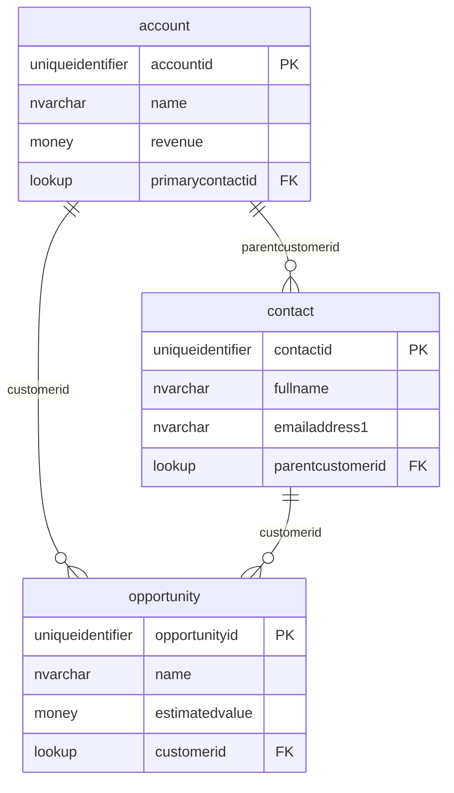

# Proposal: generate_erd MCP Tool

## Priority: 13 (Visualization — Quick win for schema documentation)

## Phase: 3 — ALM & Operations (Long Term)

## Analysis Reference

- **Gap #12** in MCP-Analysis-2026.md (Schema Visualization)
- **Impact**: 🟢 Low
- **Effort**: Low (quick win — uses existing metadata APIs)
- **Competitor**: mwhesse already has ERD generation

## Why This Tool Is Needed

Visualizing entity relationships as ERD diagrams helps developers understand the data model at a glance. mwhesse already offers Mermaid ERD generation. This would be a quick win using existing `get_entity_metadata` APIs.

## Purpose

Generate a Mermaid ERD diagram from Dataverse entity relationships.

## Parameters

| Parameter | Type | Required | Default | Description |
|-----------|------|----------|---------|-------------|
| entities | string | Yes | - | Comma-separated entity logical names (e.g., `"account,contact,opportunity"`). |
| include_system_relationships | bool | No | false | Include system relationships (ownerid, createdby, etc.). Default: false. |
| max_depth | int | No | 1 | Depth of relationship traversal. 1 = direct only, 2 = include related entities' relationships. |
| solution_name | string | No | `""` | Limit to entities in a specific solution. |

## Output Format

Returns a Mermaid ERD diagram as text:



## Response Format (Compact)

```
[ERD] 3 entities, 4 relationships

```mermaid
erDiagram
    account ||--o{ contact : "parentcustomerid"
    ...
```

Tip: Copy the Mermaid code to a .md file or paste into any Mermaid renderer.
```

## McpServerTool Attribute

```csharp
[McpServerTool(
    Name = "generate_erd",
    Title = "Generate Mermaid ERD diagram from entity relationships",
    ReadOnly = true,
    Idempotent = true)]
```

## Tool Description for AI

```
Generate a Mermaid ERD diagram from Dataverse entity relationships.

PARAMETERS:
- entities (required): Comma-separated entity names (e.g., 'account,contact,opportunity').
- include_system_relationships: Include system fields (ownerid, etc.). Default: false.
- max_depth: Relationship traversal depth (default: 1).
- solution_name: Limit to entities in a solution.

RETURNS:
- Mermaid ERD diagram text with entities, attributes, and relationships

WHEN TO USE:
- To visualize the data model for documentation
- To understand entity relationships at a glance
- When explaining the schema to stakeholders
- To generate documentation artifacts

TIPS:
- Use max_depth=1 for focused diagrams, 2 for broader context
- System relationships (ownerid, createdby) add noise — keep false by default
- Paste output into any Mermaid renderer or markdown file
- Use get_entity_metadata first to identify which entities to include
```

## Implementation Notes

- Use `get_entity_metadata` internally for each entity
- Build Mermaid syntax from 1:N and N:N relationships
- Map Dataverse types to ERD-friendly types (uniqueidentifier, nvarchar, money, etc.)
- Mark primary keys with PK, foreign keys (lookups) with FK

## Command to Create

```
/create-mcp-tool "generate erd" "DynamicsCrm.DevKit.Docs\DynamicsCrm.DevKit.Cli\mcp2\13.generate_erd.md"
```
