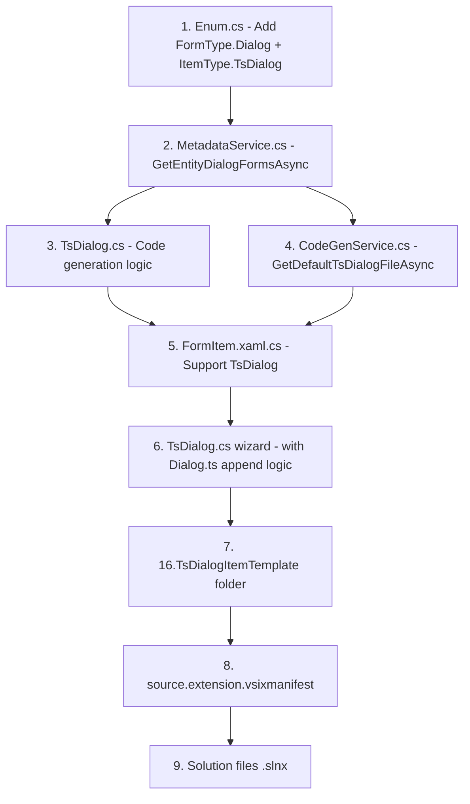

# 16. TsDialogItemTemplate — Implementation Plan

> **Purpose**: Add a new VSIX Item Template `16.TsDialogItemTemplate` that generates TypeScript dialog code for Dataverse dialog forms (FormType = 8), following the same patterns as the existing `14.JsFormTsItemTemplate` / `TsForm`.

---

## Background & Context

### What is a Dialog?

Dataverse "Dialog Builder" dialogs are forms stored in the `systemform` entity with `type = 8` (Dialog). They have:
- A `formxml` that defines tabs, sections, and controls (buttons, lookups, text inputs, etc.)
- A `name` (display name shown to users)
- An `objecttypecode` (the entity they belong to, e.g. `none` for global dialogs)
- An `ismanaged` flag (0 = unmanaged, 1 = managed)

> [!IMPORTANT]
> Only **unmanaged** dialogs (`ismanaged = 0`) should be loaded by VSIX.

### Reference Code (Production Example)

From `D:\azure\abiz\HONGNGA\SourceCode\src\Abiz.WebResourceTs\entities\`:

**User code — `Dialog.ts`** (IIFE pattern, imports generated dialog):
```typescript
import { CreateQuote } from './CreateQuote.dialog';

const ab_create_quote_dialog = (function () {
    "use strict";

    let dialog: CreateQuote.IDialog;

    async function OnLoad(executionContext: any): Promise<void> {
        dialog = new CreateQuote.Dialog(executionContext);
    }

    async function OkClick(executionContext: any): Promise<void> {
    }

    async function CancelClick(executionContext: any): Promise<void> {
        dialog.Close();
    }

    return {
        OnLoad: OnLoad,
        OkClick: OkClick,
        CancelClick: CancelClick,
    };
})();

export { ab_create_quote_dialog };
```

**Generated code — `CreateQuote.dialog.ts`** (namespace, interfaces, class extending `FormBase`):
```typescript
export namespace CreateQuote {
    export interface IDialog extends DevKit.IDialog {
        ab_amount: DevKit.Dialog.String;
        ab_lookup_customer: DevKit.Dialog.Lookup;
        OkButton: DevKit.Dialog.Button;
        CancelButton: DevKit.Dialog.Button;
        HeaderLabel: DevKit.Dialog.Label;
    }

    export class Dialog extends DevKit.FormBase<IDialog> {
        constructor(executionContext: any) {
            super(executionContext, "CreateQuote");
        }
    }
}
```

### DevKit.Dialog Types (from `devkit.d.ts`)

Available control types in the `DevKit.Dialog` namespace:

| Interface | Inheritance | Key Properties |
|---|---|---|
| `IDialogControlBase` | — | Disabled, Label, Visible |
| `IControl` | extends `IDialogControlBase` | AddOnChange, RemoveOnChange, FireOnChange, SetNotification, ClearNotification |
| `String` | extends `IControl` | Value: string |
| `Memo` | extends `IControl` | Value: string |
| `Integer` | extends `IControl` | Value: number |
| `Decimal` | extends `IControl` | Value: number |
| `Double` | extends `IControl` | Value: number |
| `Money` | extends `IControl` | Value: number |
| `Boolean` | extends `IControl` | Value: boolean |
| `OptionSet` | extends `IControlSelect` | Options, SelectedOption, Value: number |
| `MultiOptionSet` | extends `IControlSelect` | Value: Array\<number\> |
| `Lookup` | extends `IControl` | AddCustomFilter, AddCustomView, Value, DefaultView, EntityTypes |
| `DateTime` | extends `IControl` | ShowTime, Value: Date |
| `DateOnly` | extends `IControl` | Value: Date |
| `Button` | extends `IDialogControlBase` | *(no extra props)* |
| `Label` | extends `IDialogControlBase` | *(no extra props)* |
| `File` | extends `IDialogControlBase` | *(no extra props)* |
| `Image` | extends `IDialogControlBase` | *(no extra props)* |
| `WebResource` | extends `IDialogControlBase` | *(no extra props)* |
| `IFrame` | extends `IDialogControlBase` | Src |

---

## ClassId → Dialog Control Type Mapping (from [ControlClassId.cs](file:///d:/github/Dynamics-Crm-DevKit/v5/DynamicsCrm.DevKit.Shared/Models/ControlClassId.cs))

> [!NOTE]
> These ClassId constants are already defined in `ControlClassId.cs`. Dialog controls use the **exact same** GUIDs as regular form controls. The difference is: dialog controls are NOT backed by entity attributes, so the type must be resolved purely from the `classid` attribute in formxml.

| ControlClassId Constant | GUID | → `DevKit.Dialog.*` Type |
|---|---|---|
| `SINGLE_LINE_OF_TEXT` | `4273EDBD-AC1D-40D3-9FB2-095C621B552D` | `String` |
| `SINGLE_LINE_OF_TEXT_EMAIL` | `ADA2203E-B4CD-49BE-9DDF-234642B43B52` | `String` |
| `SINGLE_LINE_OF_TEXT_TICKER_SYMBOL` | `1E1FC551-F7A8-43AF-AC34-A8DC35C7B6D4` | `String` |
| `SINGLE_LINE_OF_TEXT_URL` | `71716B6C-711E-476C-8AB8-5D11542BFB47` | `String` |
| `SINGLE_LINE_OF_TEXT_PHONE` | `8C10015A-B339-4982-9474-A95FE05631A5` | `String` |
| `MULTI_LINES_OF_TEXT` | `E0DECE4B-6FC8-4A8F-A065-082708572369` | `Memo` |
| `MULTI_LINES_OF_TEXT_MAX` | `6F3FB987-393B-4D2D-859F-9D0F0349B6AD` | `Memo` |
| `MULTI_LINES_OF_TEXT_MEMO` | `F02EF977-2564-4B9A-B2F0-DF083D8A019B` | `Memo` |
| `MULTI_LINES_OF_TEXT_MEMO_2` | `1479835F-F852-4679-B864-C6892A2844C9` | `Memo` |
| `MULTI_LINES_OF_TEXT_DESCRIPTION` | `F94DB24F-263D-44A7-B38E-A35E9854812B` | `Memo` |
| `WHOLE_NUMBER` | `C6D124CA-7EDA-4A60-AEA9-7FB8D318B68F` | `Integer` |
| `WHOLE_NUMBER_DURATION` | `AA987274-CE4E-4271-A803-66164311A958` | `Integer` |
| `WHOLE_NUMBER_LANGUAGE` | `671A9387-CA5A-4D1E-8AB7-06E39DDCF6B5` | `Integer` |
| `WHOLE_NUMBER_LANGUAGE_2` | `B634828E-C390-444A-AFE6-E07315D9D970` | `Integer` |
| `WHOLE_NUMBER_TIMEZONE` | `7C624A0B-F59E-493D-9583-638D34759266` | `Integer` |
| `DECIMAL_NUMBER` | `C3EFE0C3-0EC6-42BE-8349-CBD9079DFD8E` | `Decimal` |
| `FLOATING_POINT_NUMBER` | `0D2C745A-E5A8-4C8F-BA63-C6D3BB604660` | `Double` |
| `CURRENCY` | `533B9E00-756B-4312-95A0-DC888637AC78` | `Money` |
| `TWO_OPTIONS` | `67FAC785-CD58-4F9F-ABB3-4B7DDC6ED5ED` | `Boolean` |
| `TWO_OPTIONS_2` | `B0C6723A-8503-4FD7-BB28-C8A06AC933C2` | `Boolean` |
| `STATUS_CODE` / `OPTIONSET` | `5D68B988-0661-4DB2-BC3E-17598AD3BE6C` | `OptionSet` |
| `STATE_CODE` | `3EF39988-22BB-4F0B-BBBE-64B5A3748AEE` | `OptionSet` |
| `MULTI_OPTIONSET` | `4AA28AB7-9C13-4F57-A73D-AD894D048B5F` | `MultiOptionSet` |
| `LOOKUP` | `270BD3DB-D9AF-4782-9025-509E298DEC0A` | `Lookup` |
| `LOOKUP_2` | `3246F906-1F71-45F7-B11F-D7BE0F9D04C9` | `Lookup` |
| `LOOKUP_3` | `5F986642-5961-4D9F-AB5E-643D71E231E9` | `Lookup` |
| `LOOKUP_4` | `B68B05F0-A46D-43F8-843B-917920AF806A` | `Lookup` |
| `DATE_TIME` | `5B773807-9FB2-42DB-97C3-7A91EFF8ADFF` | `DateTime` |
| `FILE` | `0A7FF475-B016-4687-9CE5-042BFDBD6519` | `File` |
| `IMAGE` | `7E548B0D-209C-477B-9DCD-F0F44472381D` | `Image` |
| `WEB_RESOURCE` | `9FDF5F91-88B1-47F4-AD53-C11EFC01A01D` | `WebResource` |
| `IFRAME` | `FD2A7985-3187-444E-908D-6624B21F69C0` | `IFrame` |
| `BUTTON` *(from guid.js)* | `00AD73DA-BD4D-49C6-88A8-2F4F4CAD4A20` | `Button` |
| `LABEL` *(from guid.js)* | `39354E4A-5015-4D74-8031-EA9EB73A1322` | `Label` |
| *(unknown classid)* | — | `String` *(fallback)* |

**How TsForm.cs does it** (reference for dialog implementation):

1. [GetBodyFields](file:///d:/github/Dynamics-Crm-DevKit/v5/DynamicsCrm.DevKit.Shared/Logic/TsForm.cs#L1263-L1344) — Parses formxml `<control>` elements extracting `datafieldname`, `id`, `classid`, `uniqueid`
2. [GetControlType](file:///d:/github/Dynamics-Crm-DevKit/v5/DynamicsCrm.DevKit.Shared/Logic/TsForm.cs#L1977-L2042) — Maps classid → type string for virtual controls (SubGrid, IFrame, WebResource, etc.)
3. [GetAttributeType](file:///d:/github/Dynamics-Crm-DevKit/v5/DynamicsCrm.DevKit.Shared/Logic/TsForm.cs#L2044-L2080) — Maps `AttributeMetadata.AttributeType` for entity-attribute-backed controls

> [!IMPORTANT]
> For **dialogs**, controls are NOT backed by entity attributes. The type must be resolved **purely from classid**. The `GetDialogControlType` method in `TsDialog.cs` must map classid → `DevKit.Dialog.*` type WITHOUT using `AttributeMetadata`.

---

## Proposed Changes

### Component 1: Shared Project — Enums

#### [MODIFY] [Enum.cs](file:///d:/github/Dynamics-Crm-DevKit/v5/DynamicsCrm.DevKit.Shared/Enum.cs)

1. **Add `Dialog = 8` to `FormType` enum** (line 3-8):
```diff
 public enum FormType
 {
     Main = 2,
     QuickCreate = 7,
-    QuickView = 6
+    QuickView = 6,
+    Dialog = 8
 }
```

2. **Add `TsDialog` to `ItemType` enum** (line 83-102):
```diff
     public enum ItemType
     {
         ...
-        BatFile
+        BatFile,
+        TsDialog
     }
```

---

### Component 2: Shared Project — MetadataService

#### [MODIFY] [MetadataService.cs](file:///d:/github/Dynamics-Crm-DevKit/v5/DynamicsCrm.DevKit.Shared/Services/MetadataService.cs)

**Add new method `GetEntityDialogFormsAsync`** to query dialog forms from systemform entity.

```csharp
/// <summary>
/// Get all unmanaged dialog forms (type=8, ismanaged=0).
/// Returns list of SystemForm with Name (display name), FormXml, EntityLogicalName.
/// </summary>
public async Task<List<SystemForm>> GetEntityDialogFormsAsync()
{
    var fetchData = new
    {
        formactivationstate = "1",
        type = (int)FormType.Dialog,
        ismanaged = "0"
    };
    var fetchXml = $@"
<fetch>
  <entity name='systemform'>
    <attribute name='description' />
    <attribute name='name' />
    <attribute name='formxml' />
    <attribute name='type' />
    <attribute name='objecttypecode' />
    <attribute name='formid' />
    <order attribute='name' descending='false'/>
    <filter type='and'>
      <condition attribute='formactivationstate' operator='eq' value='{fetchData.formactivationstate}'/>
      <condition attribute='type' operator='eq' value='{fetchData.type}'/>
      <condition attribute='ismanaged' operator='eq' value='{fetchData.ismanaged}'/>
    </filter>
  </entity>
</fetch>";
    XrmHelper.COUNT_RetrieveMultipleAsync++;
    var rows = await _serviceClient.RetrieveMultipleAsync(new FetchExpression(fetchXml));
    if (rows.Entities.Count == 0) return [];
    var forms = rows.Entities.Select(x => new SystemForm
    {
        Name = x.GetAttributeValue<string>("name"),
        Description = x.GetAttributeValue<string>("description"),
        FormXml = x.GetAttributeValue<string>("formxml"),
        IsQuickCreate = false,
        EntityLogicalName = x.GetAttributeValue<string>("objecttypecode"),
        FormType = FormType.Dialog,
        FormId = x.GetAttributeValue<Guid?>("formid")
    });
    return [.. forms.OrderBy(x => x.Name)];
}
```

> [!NOTE]
> This queries `systemform` where `type=8`, `formactivationstate=1` (active), and `ismanaged=0` (unmanaged).

---

### Component 3: Shared Project — Code Generation Logic

#### [NEW] [TsDialog.cs](file:///d:/github/Dynamics-Crm-DevKit/v5/DynamicsCrm.DevKit.Shared/Logic/TsDialog.cs)

Create a new class `TsDialog` in `DynamicsCrm.DevKit.Shared\Logic\` that generates dialog TypeScript code.

**Key responsibilities:**
1. Parse `formxml` of dialog forms using the same LINQ pattern as [GetBodyFields](file:///d:/github/Dynamics-Crm-DevKit/v5/DynamicsCrm.DevKit.Shared/Logic/TsForm.cs#L1263) in TsForm.cs
2. Map each control's `classid` to the appropriate `DevKit.Dialog.*` TypeScript type using the mapping table above
3. Generate the `{DialogLogicalName}.dialog.ts` file content

**Method signatures:**
```csharp
namespace DynamicsCrm.DevKit.Shared.Logic
{
    public class TsDialog
    {
        /// <summary>
        /// Generate the {dialogLogicalName}.dialog.ts content.
        /// Parses formxml, extracts controls, maps classid → DevKit.Dialog.* type.
        /// </summary>
        public static async Task<string> GetTsDialogCodeAsync(
            ServiceClient serviceClient,
            SystemForm dialogForm);

        /// <summary>
        /// Map a ControlClassId to the corresponding DevKit.Dialog.* type name.
        /// Unlike TsForm which uses AttributeMetadata, this is purely classid-based.
        /// </summary>
        private static string GetDialogControlType(string classId);

        /// <summary>
        /// Parse formxml to extract all controls with id, classid, datafieldname.
        /// Uses same LINQ pattern as TsForm.GetBodyFields but simplified (no attribute metadata lookup).
        /// </summary>
        private static List<FieldInfo> GetDialogControls(string formXml);
    }
}
```

**`GetDialogControlType` implementation:**
```csharp
private static string GetDialogControlType(string classId)
{
    // Single-line text variants
    if (classId == ControlClassId.SINGLE_LINE_OF_TEXT ||
        classId == ControlClassId.SINGLE_LINE_OF_TEXT_EMAIL ||
        classId == ControlClassId.SINGLE_LINE_OF_TEXT_TICKER_SYMBOL ||
        classId == ControlClassId.SINGLE_LINE_OF_TEXT_URL ||
        classId == ControlClassId.SINGLE_LINE_OF_TEXT_PHONE)
        return "String";

    // Multi-line text variants
    if (classId == ControlClassId.MULTI_LINES_OF_TEXT ||
        classId == ControlClassId.MULTI_LINES_OF_TEXT_MAX ||
        classId == ControlClassId.MULTI_LINES_OF_TEXT_MEMO ||
        classId == ControlClassId.MULTI_LINES_OF_TEXT_MEMO_2 ||
        classId == ControlClassId.MULTI_LINES_OF_TEXT_DESCRIPTION)
        return "Memo";

    // Whole number variants
    if (classId == ControlClassId.WHOLE_NUMBER ||
        classId == ControlClassId.WHOLE_NUMBER_DURATION ||
        classId == ControlClassId.WHOLE_NUMBER_LANGUAGE ||
        classId == ControlClassId.WHOLE_NUMBER_LANGUAGE_2 ||
        classId == ControlClassId.WHOLE_NUMBER_TIMEZONE)
        return "Integer";

    if (classId == ControlClassId.DECIMAL_NUMBER)
        return "Decimal";
    if (classId == ControlClassId.FLOATING_POINT_NUMBER)
        return "Double";
    if (classId == ControlClassId.CURRENCY)
        return "Money";

    // Boolean
    if (classId == ControlClassId.TWO_OPTIONS ||
        classId == ControlClassId.TWO_OPTIONS_2)
        return "Boolean";

    // OptionSet
    if (classId == ControlClassId.STATUS_CODE ||
        classId == ControlClassId.STATE_CODE)
        return "OptionSet";

    if (classId == ControlClassId.MULTI_OPTIONSET)
        return "MultiOptionSet";

    // Lookup variants
    if (classId == ControlClassId.LOOKUP ||
        classId == ControlClassId.LOOKUP_2 ||
        classId == ControlClassId.LOOKUP_3 ||
        classId == ControlClassId.LOOKUP_4)
        return "Lookup";

    if (classId == ControlClassId.DATE_TIME)
        return "DateTime";
    if (classId == ControlClassId.FILE)
        return "File";
    if (classId == ControlClassId.IMAGE)
        return "Image";
    if (classId == ControlClassId.WEB_RESOURCE)
        return "WebResource";
    if (classId == ControlClassId.IFRAME)
        return "IFrame";

    // Dialog-specific controls from Dataverse-Dialog-Builder guid.js
    if (classId == "00AD73DA-BD4D-49C6-88A8-2F4F4CAD4A20")
        return "Button";
    if (classId == "39354E4A-5015-4D74-8031-EA9EB73A1322")
        return "Label";

    // Fallback
    return "String";
}
```

**`GetDialogControls` implementation** (follows TsForm.GetBodyFields pattern):
```csharp
private static List<FieldInfo> GetDialogControls(string formXml)
{
    var xdoc = XDocument.Parse(formXml);
    var rawFields = (from x in xdoc
            .Descendants("tabs").Descendants("tab")
            .Descendants("columns").Descendants("column")
            .Descendants("sections").Descendants("section")
            .Descendants("rows").Descendants("row")
            .Descendants("cell").Descendants("control")
        select new FieldInfo
        {
            LogicalName = x?.Attribute("datafieldname")?.Value,
            Id = x?.Attribute("id")?.Value,
            ClassId = Helper.TrimGuid(x?.Attribute("classid")?.Value?.ToUpper()),
            ControlId = x?.Attribute("uniqueid")?.Value
        }).ToList();

    return rawFields
        .Where(x => !string.IsNullOrEmpty(x.Id))
        .OrderBy(x => x.Id)
        .ToList();
}
```

**Generated output structure** (for a dialog named "Create Quote" with logical name `ab_create_quote`):
```typescript
export namespace CreateQuote {

    export interface IDialog extends DevKit.IDialog {
        /** ab_amount field */
        ab_amount: DevKit.Dialog.String;
        /** ab_lookup_customer field */
        ab_lookup_customer: DevKit.Dialog.Lookup;
        /** OkButton button */
        OkButton: DevKit.Dialog.Button;
        /** CancelButton button */
        CancelButton: DevKit.Dialog.Button;
    }

    export class Dialog extends DevKit.FormBase<IDialog> {
        constructor(executionContext: any) {
            super(executionContext, "ab_create_quote");
        }
    }
}
```

---

### Component 4: Shared Project — CodeGenService

#### [MODIFY] [CodeGenService.cs](file:///d:/github/Dynamics-Crm-DevKit/v5/DynamicsCrm.DevKit.Shared/Services/CodeGenService.cs)

**Add new method `GetDefaultTsDialogFileAsync`** to generate the default IIFE code block for a single dialog. This code is the **user code** that goes into `Dialog.ts`.

```csharp
/// <summary>
/// Generate the IIFE code block for a single dialog.
/// This gets written into Dialog.ts.
/// </summary>
public async Task<string> GetDefaultTsDialogFileAsync(
    SystemForm dialogForm, string dialogClassName)
{
    await Helper.DelayAsync(1);
    var logicalName = dialogForm.Name; // The dialog's logical name
    var code = string.Empty;
    code += $"import {{ {dialogClassName} }} from './{dialogClassName}.dialog';{NEW_LINE}";
    code += $"{NEW_LINE}";
    code += $"const {logicalName}_dialog = (function () {{{NEW_LINE}";
    code += $"{TAB}\"use strict\";{NEW_LINE}";
    code += $"{NEW_LINE}";
    code += $"{TAB}let dialog: {dialogClassName}.IDialog;{NEW_LINE}";
    code += $"{NEW_LINE}";
    code += $"{TAB}async function OnLoad(executionContext: any): Promise<void> {{{NEW_LINE}";
    code += $"{TAB}{TAB}dialog = new {dialogClassName}.Dialog(executionContext);{NEW_LINE}";
    code += $"{TAB}}}{NEW_LINE}";
    code += $"{NEW_LINE}";
    code += $"{TAB}async function OkClick(executionContext: any): Promise<void> {{{NEW_LINE}";
    code += $"{TAB}}}{NEW_LINE}";
    code += $"{NEW_LINE}";
    code += $"{TAB}async function CancelClick(executionContext: any): Promise<void> {{{NEW_LINE}";
    code += $"{TAB}{TAB}dialog.Close();{NEW_LINE}";
    code += $"{TAB}}}{NEW_LINE}";
    code += $"{NEW_LINE}";
    code += $"{TAB}return {{{NEW_LINE}";
    code += $"{TAB}{TAB}OnLoad: OnLoad,{NEW_LINE}";
    code += $"{TAB}{TAB}OkClick: OkClick,{NEW_LINE}";
    code += $"{TAB}{TAB}CancelClick: CancelClick,{NEW_LINE}";
    code += $"{TAB}}};{NEW_LINE}";
    code += $"}})();{NEW_LINE}";
    return code;
}
```

---

### Component 5: VSIX — Dialog Item Selection Form

#### [MODIFY] [FormItem.xaml.cs](file:///d:/github/Dynamics-Crm-DevKit/v5/DynamicsCrm.DevKit/Lib/Forms/FormItem.xaml.cs)

Add support for `ItemType.TsDialog`:
1. When `ItemType == TsDialog`, load **dialog forms** from `systemform` entity using `MetadataService.GetEntityDialogFormsAsync()`
2. Display dialog **display names** in the list (but store logical name for code gen)
3. Store the selected `SystemForm` object for the wizard to use

**Key changes:**
- Add a `public SystemForm SelectedDialogForm { get; set; }` property
- In the entity loading logic, add a branch for `ItemType.TsDialog` that calls `GetEntityDialogFormsAsync()` and populates the list with dialog names
- On selection, set `SelectedDialogForm` and `ItemName` (PascalCase class name from dialog name)

---

### Component 6: VSIX — Item Template Wizard

#### [NEW] [TsDialog.cs](file:///d:/github/Dynamics-Crm-DevKit/v5/DynamicsCrm.DevKit/Wizard/ItemTemplates/TsDialog.cs)

Create a new wizard class following the [TsForm.cs](file:///d:/github/Dynamics-Crm-DevKit/v5/DynamicsCrm.DevKit/Wizard/ItemTemplates/TsForm.cs) pattern.

**Key behaviors:**

##### `RunStarted`:
1. Show `FormItem` dialog with `ItemType.TsDialog`
2. Get selected dialog form (`SelectedDialogForm`)
3. Compute `dialogClassName` (PascalCase) from the dialog logical name
4. Generate `{DialogName}.dialog.ts` content via `TsDialog.GetTsDialogCodeAsync()`
5. Generate the IIFE code block via `CodeGenService.GetDefaultTsDialogFileAsync()`
6. Set replacement parameters: `$TypeScriptDialog$` and `$TypeScript$`

##### `ShouldAddProjectItem`:
- `TypeScript.ts` → maps to `Dialog.ts` — return `false` if file already exists (DON'T overwrite)
- `TypeScript.dialog.ts` → maps to `{DialogName}.dialog.ts` — always add/overwrite

##### `RunFinished` (the **CRITICAL append logic**):

> [!IMPORTANT]
> **Append to existing Dialog.ts**: When `Dialog.ts` already exists and user adds a new dialog B, the wizard must:
> 1. Read the existing `Dialog.ts` content
> 2. Find the `export { ... };` line at the end
> 3. Insert the new dialog's import statement at the top (after existing imports)
> 4. Insert the new dialog's IIFE block before the export line
> 5. Add the new dialog's export variable to the export statement
> 6. Write back the updated file

**Append logic pseudo-code:**
```csharp
public void RunFinished()
{
    // 1. Write the generated .dialog.ts file content
    var dialogProjectItem = await VsixHelper.GetProjectItemAsync($"{DialogClassName}.dialog.ts");
    var dialogProjectItemFullPath = dialogProjectItem.FileNames[0];
    await FileHelper.ForceWriteAllTextAsync(dialogProjectItemFullPath, _TypeScriptDialog_);

    // 2. Handle Dialog.ts (user code)
    var dialogTsProjectItem = await VsixHelper.GetProjectItemAsync("Dialog.ts");
    var dialogTsPath = dialogTsProjectItem.FileNames[0];

    if (IsDialogTsExisting)
    {
        // APPEND mode: Dialog.ts already exists
        var existingContent = await FileHelper.ReadAllTextAsync(dialogTsPath);
        var updatedContent = AppendDialogToExistingFile(existingContent, _ImportStatement_, _IIFEBlock_, _ExportVarName_);
        await FileHelper.ForceWriteAllTextAsync(dialogTsPath, updatedContent);
    }
    // else: Dialog.ts was just created with initial content (handled by template)

    // 3. Nest .dialog.ts under Dialog.ts
    try
    {
        dialogProjectItem.Properties.Item("DependentUpon").Value = "Dialog.ts";
    }
    catch
    {
        dialogProjectItem.Remove();
        dialogTsProjectItem.ProjectItems.AddFromFile(dialogProjectItemFullPath);
    }

    await VsixHelper.ExecuteCommandAsync("File.SaveAll");
}
```

**`AppendDialogToExistingFile` helper:**
```csharp
private string AppendDialogToExistingFile(
    string existingContent, string importStatement,
    string iifeBlock, string exportVarName)
{
    var lines = existingContent.Split(new[] { "\r\n", "\n" }, StringSplitOptions.None).ToList();

    // 1. Find the last import line and insert new import AFTER it
    var lastImportIndex = lines.FindLastIndex(l => l.TrimStart().StartsWith("import "));
    if (lastImportIndex >= 0)
        lines.Insert(lastImportIndex + 1, importStatement);
    else
        lines.Insert(0, importStatement);

    // 2. Find the `export { ... }` line
    var exportIndex = lines.FindLastIndex(l => l.TrimStart().StartsWith("export {"));
    if (exportIndex >= 0)
    {
        // Insert IIFE block BEFORE the export line (with blank line)
        lines.Insert(exportIndex, "");
        lines.Insert(exportIndex, iifeBlock);

        // Update export line to include new variable
        // "export { ab_create_quote_dialog };"
        // → "export { ab_create_quote_dialog, ab_approve_order_dialog };"
        var exportLine = lines[exportIndex + iifeBlock.Split('\n').Length + 1];
        var updatedExport = exportLine.Replace(" };", $", {exportVarName} }};");
        lines[exportIndex + iifeBlock.Split('\n').Length + 1] = updatedExport;
    }
    else
    {
        // No export found, append IIFE + export at end
        lines.Add("");
        lines.Add(iifeBlock);
        lines.Add($"export {{ {exportVarName} }};");
    }

    return string.Join("\r\n", lines);
}
```

**Example — Dialog.ts BEFORE adding dialog B:**
```typescript
import { CreateQuote } from './CreateQuote.dialog';

const ab_create_quote_dialog = (function () {
    "use strict";
    // ... existing code ...
})();

export { ab_create_quote_dialog };
```

**Example — Dialog.ts AFTER adding dialog B (ab_approve_order):**
```typescript
import { CreateQuote } from './CreateQuote.dialog';
import { ApproveOrder } from './ApproveOrder.dialog';

const ab_create_quote_dialog = (function () {
    "use strict";
    // ... existing code ...
})();

const ab_approve_order_dialog = (function () {
    "use strict";

    let dialog: ApproveOrder.IDialog;

    async function OnLoad(executionContext: any): Promise<void> {
        dialog = new ApproveOrder.Dialog(executionContext);
    }

    async function OkClick(executionContext: any): Promise<void> {
    }

    async function CancelClick(executionContext: any): Promise<void> {
        dialog.Close();
    }

    return {
        OnLoad: OnLoad,
        OkClick: OkClick,
        CancelClick: CancelClick,
    };
})();

export { ab_create_quote_dialog, ab_approve_order_dialog };
```

---

### Component 7: Item Template Project

#### [NEW] `ItemTemplates/CSharp/16.TsDialogItemTemplate/` (entire folder)

Create a new VS Item Template project mirroring `14.JsFormTsItemTemplate`:

| File | Content |
|---|---|
| `CSharpTsDialogItemTemplate.vstemplate` | Template definition (see below) |
| `TypeScript.dialog.ts` | `$TypeScriptDialog$` |
| `TypeScript.ts` | `$TypeScript$` |
| `icon.png` | Copy from 14.JsFormTsItemTemplate |
| `16.TsDialogItemTemplate.csproj` | Project file (copy pattern from 14) |

**vstemplate:**
```xml
<?xml version="1.0" encoding="utf-8"?>
<VSTemplate Version="3.0.0" Type="Item"
  xmlns="http://schemas.microsoft.com/developer/vstemplate/2005"
  xmlns:sdk="http://schemas.microsoft.com/developer/vstemplate-sdkextension/2010">
  <TemplateData>
    <Name>16. TypeScript Dialog</Name>
    <Description>Generates a Dataverse TypeScript dialog scaffold with typed interfaces for dialog controls.</Description>
    <DefaultName>TypeScript.dialog.ts</DefaultName>
    <TemplateID>AAAAAAAA-AAAA-AAAA-BBBB-000000000016</TemplateID>
    <Icon>icon.png</Icon>
    <ProjectType>CSharp</ProjectType>
    <ProjectSubType>Visual C#</ProjectSubType>
    <AppliesTo>CSharp</AppliesTo>
    <RequiredFrameworkVersion>4.0</RequiredFrameworkVersion>
    <NumberOfParentCategoriesToRollUp>0</NumberOfParentCategoriesToRollUp>
    <SortOrder>260</SortOrder>
  </TemplateData>
  <TemplateContent>
    <ProjectItem ReplaceParameters="true" OpenInEditor="false"
      TargetFileName="$DialogName$.dialog.ts">TypeScript.dialog.ts</ProjectItem>
    <ProjectItem ReplaceParameters="true" OpenInEditor="false"
      TargetFileName="Dialog.ts">TypeScript.ts</ProjectItem>
  </TemplateContent>
  <WizardExtension>
    <Assembly>DynamicsCrm.DevKit, Version=4.12.34.56, Culture=Neutral, PublicKeyToken=null</Assembly>
    <FullClassName>DynamicsCrm.DevKit.Wizard.ItemTemplates.TsDialog</FullClassName>
  </WizardExtension>
</VSTemplate>
```

---

### Component 8: VSIX Manifest

#### [MODIFY] [source.extension.vsixmanifest](file:///d:/github/Dynamics-Crm-DevKit/v5/DynamicsCrm.DevKit/source.extension.vsixmanifest)

Add the new item template asset:
```xml
<Asset Type="Microsoft.VisualStudio.ItemTemplate" d:Source="Project"
  d:ProjectName="16.TsDialogItemTemplate"
  d:TargetPath="|16.TsDialogItemTemplate;TemplateProjectOutputGroup|"
  Path="ItemTemplates" d:VsixSubPath="ItemTemplates" />
```

---

### Component 9: Solution Files

#### [MODIFY] Solution files (`.slnx`)

Add the new project reference to both:
- [DynamicsCrm.DevKit.slnx](file:///d:/github/Dynamics-Crm-DevKit/v5/DynamicsCrm.DevKit.slnx)
- [DynamicsCrm.DevKit.AllInOne.slnx](file:///d:/github/Dynamics-Crm-DevKit/v5/DynamicsCrm.DevKit.AllInOne.slnx)

```xml
<Project Path="ItemTemplates\CSharp\16.TsDialogItemTemplate\16.TsDialogItemTemplate.csproj" />
```

---

## Summary of All Files to Create/Modify

| Action | File | Component |
|--------|------|-----------|
| **MODIFY** | `DynamicsCrm.DevKit.Shared\Enum.cs` | Add `FormType.Dialog=8`, `ItemType.TsDialog` |
| **MODIFY** | `DynamicsCrm.DevKit.Shared\Services\MetadataService.cs` | Add `GetEntityDialogFormsAsync()` |
| **NEW** | `DynamicsCrm.DevKit.Shared\Logic\TsDialog.cs` | Dialog code generation logic (classid-based) |
| **MODIFY** | `DynamicsCrm.DevKit.Shared\Services\CodeGenService.cs` | Add `GetDefaultTsDialogFileAsync()` |
| **MODIFY** | `DynamicsCrm.DevKit\Lib\Forms\FormItem.xaml.cs` | Support `ItemType.TsDialog` in dialog selector |
| **NEW** | `DynamicsCrm.DevKit\Wizard\ItemTemplates\TsDialog.cs` | Wizard with append-to-existing Dialog.ts logic |
| **NEW** | `ItemTemplates\CSharp\16.TsDialogItemTemplate\` (folder) | VS item template files |
| **MODIFY** | `DynamicsCrm.DevKit\source.extension.vsixmanifest` | Register new template asset |
| **MODIFY** | Solution files (`.slnx`) | Add project reference |

---

## Key Design Decisions

### 1. Dialog Name → File Name Mapping

| Dialog Name (display) | Logical Name | Generated Class | Generated File | Export Variable |
|---|---|---|---|---|
| `Create Quote` or `ab_create_quote` | `ab_create_quote` | `CreateQuote` | `CreateQuote.dialog.ts` | `ab_create_quote_dialog` |

- **PascalCase class name**: Split on `_`, capitalize each word, remove publisher prefix
- **Export variable**: `{logicalname}_dialog` (preserves the logical name as-is, appends `_dialog`)

### 2. File Nesting Strategy

```
entities/
├── Dialog.ts                    ← user code (IIFE + exports)
│   └── CreateQuote.dialog.ts    ← generated (nested under Dialog.ts)
│   └── ApproveOrder.dialog.ts   ← generated (nested under Dialog.ts)
```

- `Dialog.ts` is always the parent file
- All `*.dialog.ts` files are `DependentUpon` → `Dialog.ts`
- If `Dialog.ts` doesn't exist when adding a dialog, it gets created with initial IIFE template
- If `Dialog.ts` already exists, **APPEND the new dialog's import + IIFE + export variable** to it

### 3. ClassId-Based Type Resolution

Unlike `TsForm` which uses `AttributeMetadata` for type resolution, `TsDialog` resolves types **purely from classid** using the mapping table in `ControlClassId.cs`. This is because dialog controls are not backed by entity attributes.

---

## Verification Plan

### Build Verification

```powershell
# Build VSIX to verify compilation
& "C:\Program Files\Microsoft Visual Studio\18\Professional\MSBuild\Current\Bin\MSBuild.exe" `
    "DynamicsCrm.DevKit\DynamicsCrm.DevKit.csproj" `
    /p:Configuration=Debug /t:Build
```

### Manual Verification (Required — AI cannot test VSIX in Visual Studio)

> [!CAUTION]
> VSIX extensions can only be tested by running Visual Studio with the experimental instance. This must be done by anh Phước manually.

**Test Scenario 1 — First dialog (Dialog.ts does NOT exist):**
1. Open a WebResourceTs project in VS
2. Right-click `entities` folder → Add → New Item → "16. TypeScript Dialog"
3. Verify: FormItem dialog shows list of unmanaged dialogs (display names)
4. Select a dialog (e.g. "Create Quote") → OK
5. Verify files created:
   - `Dialog.ts` — contains import + IIFE for `ab_create_quote_dialog` + export
   - `CreateQuote.dialog.ts` — contains namespace + IDialog interface + Dialog class
6. Verify `CreateQuote.dialog.ts` nested under `Dialog.ts` in Solution Explorer
7. Verify TypeScript compiles (no red squiggles)

**Test Scenario 2 — Second dialog (Dialog.ts ALREADY exists):**
1. With Dialog.ts from Scenario 1 still present
2. Add another dialog (e.g. "Approve Order")
3. Verify:
   - `ApproveOrder.dialog.ts` — created and nested under `Dialog.ts`
   - `Dialog.ts` — **APPENDED** with new import + IIFE for `ab_approve_order_dialog`
   - Export line updated: `export { ab_create_quote_dialog, ab_approve_order_dialog };`
   - Original code for `ab_create_quote_dialog` is **unchanged**

### Pre-Implementation Research

To validate dialog formxml structure before coding, try to fetch a real dialog formxml from Dataverse (when MCP connection is available):
```
FetchXML: <fetch top='1'>
  <entity name='systemform'>
    <attribute name='name'/><attribute name='formxml'/><attribute name='type'/>
    <filter><condition attribute='type' operator='eq' value='8'/>
    <condition attribute='ismanaged' operator='eq' value='0'/></filter>
  </entity>
</fetch>
```

---

## Dependencies & Order of Implementation



Implementation should proceed in the numbered order above.
