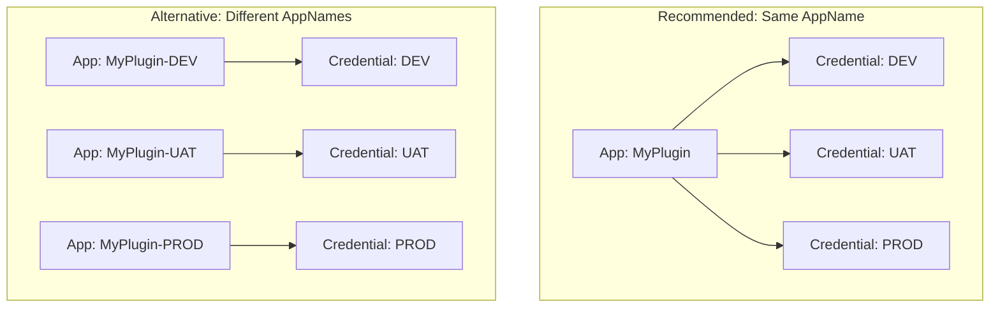

# Plugin Managed Identity Setup

This guide explains how to configure and deploy Dataverse Plugins using Azure Managed Identity.

For more information, see the official Microsoft documentation: [Power Platform Managed Identity Overview](https://learn.microsoft.com/en-us/power-platform/admin/managed-identity-overview).

## What This Script Creates

The script creates only the **minimum required** Azure resources for Managed Identity:

| Resource | Purpose |
|----------|---------|
| **App Registration** | Azure AD application identity for your plugin |
| **Service Principal** | Enterprise application for authentication |
| **Code Signing Certificate** | Required to sign your plugin assembly (.pfx, .cer) |
| **Federated Credential** | Links Power Platform environment to your Azure AD app |
| **AssemblyInfo2.cs** | C# attribute file for your plugin project |

> **Note**: This script does NOT create Resource Groups, Key Vaults, Storage Accounts, or other Azure resources. Those are **optional** and depend on what Azure services your plugin needs to access.

## Files

| File | Description |
|------|-------------|
| `Plugin-Managed-Identity.ps1` | PowerShell script to automate setup |
| `Plugin-Managed-Identity-Config.json` | Configuration file |
| `Plugin-Managed-Identity.md` | This documentation |

## Prerequisites

1. **Azure CLI**: Ensure `az` is installed and you are logged in (`az login`)
2. **Power Platform**: Admin access to target Dataverse environment
3. **Permissions**: Application Administrator or Cloud Application Administrator in Azure AD

## ⚠️ Critical: NuGet Package Version Requirements

> [!IMPORTANT]
> If your plugin uses Azure SDK packages (e.g., for Key Vault, Storage), you **MUST** use specific versions. Using newer versions will cause deployment failures!

### Required Package Versions

Add these exact versions to your `.csproj` file:

```xml
<!-- Azure.Identity 1.9.0 and Azure.Security.KeyVault.Secrets 4.5.0 do NOT have System.ClientModel dependency -->
<PackageReference Include="Azure.Identity" Version="1.9.0" />
<PackageReference Include="Azure.Security.KeyVault.Secrets" Version="4.5.0" />
```

### Why These Specific Versions?

| Package | Required Version | Reason |
|---------|------------------|--------|
| `Azure.Identity` | **1.9.0** | Does NOT depend on `System.ClientModel` |
| `Azure.Security.KeyVault.Secrets` | **4.5.0** | Does NOT depend on `System.ClientModel` |

**What happens if you use newer versions?**
- Newer versions (e.g., Azure.Identity 1.10+) introduce a dependency on `System.ClientModel`
- `System.ClientModel` is **NOT compatible** with the Dataverse plugin sandbox environment
- Your plugin deployment will **FAIL** with assembly loading errors

---

## Step 1: Configuration

Open `Plugin-Managed-Identity-Config.json` and fill in the required values:

### Single Environment

```json
{
  "CertificateFileName": "my-plugin-cert",
  "CertificatePassword": "YourStrongPassword123!",
  "CertificateValidityYears": 10,
  "ManagedIdentities": [
    {
      "AppName": "My-Dataverse-Plugin-App",
      "EnvironmentId": "00000000-0000-0000-0000-000000000000",
      "CredentialName": "PowerPlatform-DEV"
    }
  ]
}
```

### Multiple Environments (Recommended)

> [!TIP]
> **Use the SAME `AppName` across multiple environments** to avoid unmanaged layer issues when deploying solutions!

```json
{
  "CertificateFileName": "my-plugin-cert",
  "CertificatePassword": "YourStrongPassword123!",
  "CertificateValidityYears": 10,
  "ManagedIdentities": [
    {
      "AppName": "My-Dataverse-Plugin-App",
      "EnvironmentId": "11111111-0000-0000-0000-000000000000",
      "CredentialName": "PowerPlatform-DEV"
    },
    {
      "AppName": "My-Dataverse-Plugin-App",
      "EnvironmentId": "22222222-0000-0000-0000-000000000000",
      "CredentialName": "PowerPlatform-UAT"
    },
    {
      "AppName": "My-Dataverse-Plugin-App",
      "EnvironmentId": "33333333-0000-0000-0000-000000000000",
      "CredentialName": "PowerPlatform-PROD"
    }
  ]
}
```

### Configuration Fields

| Field | Required | Description |
|-------|:--------:|-------------|
| `CertificateFileName` | ✅ | Name for the certificate files (without extension) |
| `CertificatePassword` | ✅ | Password to protect the .pfx file |
| `CertificateValidityYears` | ✅ | How many years the certificate is valid |
| `AppName` | ✅ | Display name for the Azure AD App Registration |
| `EnvironmentId` | ✅ | Your Dataverse Environment ID (from Power Platform Admin Center) |
| `CredentialName` | ✅ | Unique name for the Federated Credential (e.g., `PowerPlatform-DEV`) |
| `TenantId` | Auto | Auto-populated by the script |
| `AppId` | Auto | Auto-populated by the script |

---

## Multi-Environment Deployment Strategy

> [!IMPORTANT]
> Understanding how `AppName` affects solution deployment is critical for avoiding unmanaged layers!

### ✅ Recommended: Same AppName (Same App Registration)

When entries have the **same `AppName`**, the script:
1. Creates **ONE App Registration** shared across all environments
2. Creates **multiple Federated Credentials** (one per environment with unique `CredentialName`)
3. Generates **one `ApplicationId`** in `AssemblyInfo2.cs`

**Benefits:**
- ✅ Deploy solutions without unmanaged layer issues
- ✅ Plugin Assembly uses same `ApplicationId` across all environments
- ✅ No ALM complications

### ⚠️ Alternative: Different AppNames (Different App Registrations)

When entries have **different `AppName`**, the script:
1. Creates **separate App Registrations** for each unique name
2. Generates **multiple `ApplicationIds`** in `AssemblyInfo2.cs`

**Considerations:**
- ⚠️ Each environment uses a different `ApplicationId`
- ⚠️ When deploying solution, plugin will have **unmanaged layer**
- ⚠️ Must use **ALM Pipeline** to rebind `ApplicationId` to plugin assembly after deploy



---

## Step 2: Run the Script

Execute the PowerShell script:

```powershell
.\Plugin-Managed-Identity.ps1
```

The script will:
1. Create/verify **App Registration** and **Service Principal**
2. Generate a **self-signed code signing certificate** (.pfx and .cer)
3. Configure **Federated Credentials** for each environment
4. Generate **AssemblyInfo2.cs** with the Managed Identity attribute
5. Update the configuration file with generated IDs

---

## Step 3: Integrate with Your Project

After the script completes:

1. **Add AssemblyInfo2.cs** to your plugin project
2. **Add the .pfx file** to your project:
   - Build Action: `None`
   - Copy to Output Directory: `Do not copy`
3. **Build** your project

---

## Step 4: Grant Access to Azure Resources (OPTIONAL)

Your App Registration now exists, but it has **no permissions** to any Azure resources yet. You need to grant access based on what services your plugin uses:

### For Azure Key Vault

```powershell
# Using Azure Portal:
# Key Vault → Access Policies → Add Access Policy → Select your App

# Or using Azure CLI:
az keyvault set-policy --name "your-keyvault" --spn "your-app-id" --secret-permissions get list
```

### For Azure Storage

```powershell
# Assign Storage Blob Data Reader role
az role assignment create \
  --assignee "your-app-id" \
  --role "Storage Blob Data Reader" \
  --scope "/subscriptions/{sub}/resourceGroups/{rg}/providers/Microsoft.Storage/storageAccounts/{storage}"
```

### For Azure SQL

```sql
-- In SQL Server, add as external user
CREATE USER [your-app-name] FROM EXTERNAL PROVIDER;
ALTER ROLE db_datareader ADD MEMBER [your-app-name];
```

---

## Step 5: Managed Identity Record in Dataverse

> [!TIP]
> **DevKit CLI handles this automatically!** When you deploy using `devkit server`, the CLI reads the `AssemblyInfo2.cs` attributes and automatically creates/updates the Managed Identity record in Dataverse for you. No manual steps required!

---

## Step 6: Deploy Your Plugin

Use the DevKit CLI to deploy:

```powershell
devkit server --profile "YourProfile"
```

The CLI will automatically:
- Read the Managed Identity configuration from `AssemblyInfo2.cs`
- Sign the assembly using the .pfx certificate
- Deploy to Dataverse with Managed Identity enabled

---

## Delegation Workflow (If You Don't Have Permissions)

If you cannot obtain the required Azure AD permissions, follow this workflow:

### Files to Send to Administrator

| File | Description |
|------|-------------|
| `Plugin-Managed-Identity.ps1` | The automation script |
| `Plugin-Managed-Identity-Config.json` | Configuration (fill in your values first) |
| `Plugin-Managed-Identity.md` | This documentation |

### Files Administrator Returns

| File | Description |
|------|-------------|
| `Plugin-Managed-Identity-Config.json` | Updated with AppId, TenantId, etc. |
| `*.pfx` | Certificate file (handle securely!) |
| `*.cer` | Public certificate |
| `AssemblyInfo2.cs` | C# attribute file |

---

## Troubleshooting

| Issue | Solution |
|-------|----------|
| Script fails with permission error | Ensure you have Application Administrator role in Azure AD |
| Certificate errors | Re-run the script to regenerate certificate |
| Plugin deployment fails | Verify EnvironmentId matches your Dataverse environment |
| "System.ClientModel" error | Use Azure.Identity 1.9.0 and Azure.Security.KeyVault.Secrets 4.5.0 |
| Unmanaged layer on deploy | Ensure all environments use same `AppName` in config |

---

## Security Notes

> [!CAUTION]
> - **DO NOT commit** the `.pfx` file to source control
> - **DO NOT commit** `Plugin-Managed-Identity-Config.json` if it contains real passwords
> - Use `.gitignore` to exclude sensitive files
> - Handle `.pfx` files securely - use encrypted file transfer

### Recommended .gitignore entries

```gitignore
*.pfx
*.cer
Plugin-Managed-Identity-Config.json
AssemblyInfo2.cs
```
