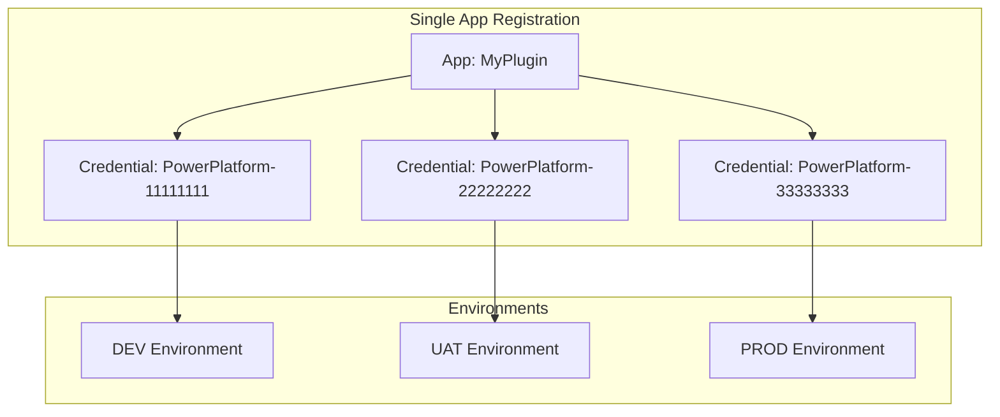

# Plugin Managed Identity Setup

This guide explains how to configure and deploy Dataverse Plugins using Azure Managed Identity.

📖 For more information, see the official Microsoft documentation: [Power Platform Managed Identity Overview](https://learn.microsoft.com/en-us/power-platform/admin/managed-identity-overview)

---

## Overview

### What This Script Creates

The script creates only the **minimum required** Azure resources for Managed Identity:

| Resource | Purpose |
|----------|---------|
| **App Registration** | Azure AD application identity for your plugin |
| **Service Principal** | Enterprise application for authentication |
| **Code Signing Certificate** | Required to sign your plugin assembly (.pfx, .cer) |
| **Federated Credential** | Links Power Platform environment to your Azure AD app |
| **AssemblyInfo2.cs** | C# attribute file for your plugin project |

> **Note**: This script does NOT create Resource Groups, Key Vaults, Storage Accounts, or other Azure resources. Those are **optional** and depend on what Azure services your plugin needs to access.

### Files

| File | Description |
|------|-------------|
| `Plugin-Managed-Identity.ps1` | PowerShell script to automate setup |
| `Plugin-Managed-Identity-Config.json` | Configuration file |
| `Plugin-Managed-Identity.md` | This documentation |

### Prerequisites

1. **Azure CLI**: Ensure `az` is installed and you are logged in (`az login`)
2. **Power Platform**: Admin access to target Dataverse environment
3. **Permissions**: Application Administrator or Cloud Application Administrator in Azure AD

---

## ⚠️ Critical: NuGet Package Version Requirements

> [!IMPORTANT]
> If your plugin uses Azure SDK packages (e.g., for Key Vault, Storage), you **MUST** use specific versions. Using newer versions will cause deployment failures!

### Required Package Versions

Add these exact versions to your `.csproj` file:

```xml
<!-- Azure.Identity 1.9.0 and Azure.Security.KeyVault.Secrets 4.5.0 do NOT have System.ClientModel dependency -->
<PackageReference Include="Azure.Identity" Version="1.9.0" />
<PackageReference Include="Azure.Security.KeyVault.Secrets" Version="4.5.0" />
```

### Why These Specific Versions?

| Package | Required Version | Reason |
|---------|------------------|--------|
| `Azure.Identity` | **1.9.0** | Does NOT depend on `System.ClientModel` |
| `Azure.Security.KeyVault.Secrets` | **4.5.0** | Does NOT depend on `System.ClientModel` |

**What happens if you use newer versions?**
- Newer versions (e.g., Azure.Identity 1.10+) introduce a dependency on `System.ClientModel`
- `System.ClientModel` is **NOT compatible** with the Dataverse plugin sandbox environment
- Your plugin deployment will **FAIL** with assembly loading errors

---

## Step 1: Configuration

Open `Plugin-Managed-Identity-Config.json` and fill in the required values.

### Single Environment Example

```json
{
  "CertificateFileName": "my-plugin-cert",
  "CertificatePassword": "YourStrongPassword123!",
  "CertificateValidityYears": 10,
  "AppName": "My-Dataverse-Plugin-App",
  "EnvironmentIds": [ "00000000-0000-0000-0000-000000000000" ]
}
```

### Multiple Environments Example (Cross-Environment Deployment)

> [!TIP]
> **One App Registration, Multiple Environments**: `AppName` is at root level and shared across all environments. The script auto-generates `CredentialName` as `PowerPlatform-{first-guid-part}` for each environment.

```json
{
  "CertificateFileName": "my-plugin-cert",
  "CertificatePassword": "YourStrongPassword123!",
  "CertificateValidityYears": 10,
  "AppName": "My-Dataverse-Plugin-App",
  "EnvironmentIds": [
    "11111111-0000-0000-0000-000000000000",
    "22222222-0000-0000-0000-000000000000",
    "33333333-0000-0000-0000-000000000000"
  ]
}
```

### Configuration Fields Reference

| Field | Required | Description |
|-------|:--------:|-------------|
| `CertificateFileName` | ✅ | Name for the certificate files (without extension) |
| `CertificatePassword` | ✅ | Password to protect the .pfx file |
| `CertificateValidityYears` | ✅ | How many years the certificate is valid |
| `AppName` | ✅ | Display name for the Azure AD App Registration |
| `EnvironmentIds` | ✅ | Array of Dataverse Environment IDs (from Power Platform Admin Center) |
| `TenantId` | Auto | Auto-populated by the script after running |
| `AppId` | Auto | Auto-populated by the script after running |

> **Note**: `CredentialName` is auto-generated as `PowerPlatform-{first-guid-part}` (e.g., `PowerPlatform-11111111`)

---

## Cross-Environment Deployment Strategy

> [!IMPORTANT]
> The config structure enforces **one App Registration** for all environments, which is the recommended approach for ALM!

### How It Works

With `AppName` at the root level, the script:
1. Creates **ONE App Registration** shared across all environments
2. Creates **multiple Federated Credentials** (one per environment, auto-named)
3. Generates **one `ApplicationId`** in `AssemblyInfo2.cs`

### Benefits

- ✅ Deploy solutions without unmanaged layer issues
- ✅ Plugin Assembly uses same `ApplicationId` across all environments
- ✅ No ALM complications
- ✅ Simpler configuration - just list the environment GUIDs



---

## Step 2: Run the Script

### Execute

```powershell
.\Plugin-Managed-Identity.ps1
```

### What the Script Does

1. **App Registration**: Creates or verifies Azure AD App Registration
2. **Service Principal**: Creates or verifies Service Principal
3. **Certificate**: Generates self-signed code signing certificate (.pfx and .cer)
4. **Federated Credentials**: Configures one credential per environment
5. **AssemblyInfo2.cs**: Generates C# attribute file with Managed Identity configuration
6. **Config Update**: Saves `TenantId` and `AppId` back to config file

### Output Files

After running the script, you will have these files:

| File | Description | Action Required |
|------|-------------|-----------------|
| `{CertificateFileName}.pfx` | Private key certificate | **Add to plugin project** |
| `{CertificateFileName}.cer` | Public key certificate | Keep for reference |
| `AssemblyInfo2.cs` | C# attribute file | **Add to plugin project** |
| `Plugin-Managed-Identity-Config.json` | Updated with `TenantId` and `AppId` | Keep for reference |

### Azure AD Resources Created

| Resource | Name |
|----------|------|
| App Registration | Your `AppName` value |
| Service Principal | Auto-created for the App Registration |
| Federated Credentials | `PowerPlatform-{first-guid-part}` per environment |

---

## Step 3: Integrate with Your Project

After the script completes, add the generated files to your plugin project:

### 1. Add AssemblyInfo2.cs

Add the `AssemblyInfo2.cs` file to your plugin project. This file contains the Managed Identity attribute:

```csharp
[assembly: DynamcisCrmDevKitPluginManagedIdentityAssembly(
    TenantId = "your-tenant-id",
    ApplicationIds = "your-app-id",
    CertificateFileName = "your-cert.pfx",
    CertificatePassword = "your-password"
)]
```

### 2. Add the .pfx Certificate

Add the `.pfx` file to your project with these settings:
- **Build Action**: `None`
- **Copy to Output Directory**: `Do not copy`

### 3. Build Your Project

Build your plugin project. The DevKit will automatically:
- Detect the Managed Identity attribute
- Include the certificate in the signed assembly

---

## Step 4: Grant Access to Azure Resources (OPTIONAL)

Your App Registration now exists, but it has **no permissions** to any Azure resources yet. You need to grant access based on what services your plugin uses.

### For Azure Key Vault

**Using Azure Portal:**
1. Navigate to your Key Vault
2. Go to **Access Policies** → **Add Access Policy**
3. Select your App Registration
4. Grant **Get** and **List** permissions for Secrets

**Using Azure CLI:**
```powershell
az keyvault set-policy --name "your-keyvault" --spn "your-app-id" --secret-permissions get list
```

### For Azure Storage

```powershell
# Assign Storage Blob Data Reader role
az role assignment create `
  --assignee "your-app-id" `
  --role "Storage Blob Data Reader" `
  --scope "/subscriptions/{sub}/resourceGroups/{rg}/providers/Microsoft.Storage/storageAccounts/{storage}"
```

### For Azure SQL

```sql
-- In SQL Server, add as external user
CREATE USER [your-app-name] FROM EXTERNAL PROVIDER;
ALTER ROLE db_datareader ADD MEMBER [your-app-name];
```

---

## Step 5: Deploy Your Plugin

Use the DevKit CLI to deploy your plugin:

```powershell
devkit server --profile "YourProfile"
```

### What DevKit CLI Does Automatically

> [!TIP]
> **No manual Managed Identity setup in Dataverse!** DevKit CLI handles everything for you.

The CLI will automatically:
1. Read the Managed Identity configuration from `AssemblyInfo2.cs`
2. Sign the assembly using the `.pfx` certificate
3. Create or update the Managed Identity record in Dataverse
4. Deploy the plugin with Managed Identity enabled

---

## Delegation Workflow (If You Don't Have Permissions)

If you cannot obtain the required Azure AD permissions, follow this workflow to delegate to an administrator.

### Files to Send to Administrator

| File | Description |
|------|-------------|
| `Plugin-Managed-Identity.ps1` | The automation script |
| `Plugin-Managed-Identity-Config.json` | Configuration (fill in your values first) |
| `Plugin-Managed-Identity.md` | This documentation |

### Files Administrator Returns

| File | Description |
|------|-------------|
| `Plugin-Managed-Identity-Config.json` | Updated with AppId, TenantId, etc. |
| `*.pfx` | Certificate file (handle securely!) |
| `*.cer` | Public certificate |
| `AssemblyInfo2.cs` | C# attribute file |

---

## Troubleshooting

| Issue | Solution |
|-------|----------|
| Script fails with permission error | Ensure you have Application Administrator role in Azure AD |
| Certificate errors | Delete existing `.pfx` and `.cer` files, then re-run the script |
| Plugin deployment fails | Verify EnvironmentId matches your Dataverse environment exactly |
| "System.ClientModel" error | Use Azure.Identity 1.9.0 and Azure.Security.KeyVault.Secrets 4.5.0 |
| Federated credential errors | Ensure environment GUID is correct and you have admin access |

---

## Security Notes

> [!CAUTION]
> **Protect sensitive files!**
> - **DO NOT commit** the `.pfx` file to source control
> - **DO NOT commit** `Plugin-Managed-Identity-Config.json` if it contains real passwords
> - Use `.gitignore` to exclude sensitive files
> - Handle `.pfx` files securely - use encrypted file transfer

### Recommended .gitignore Entries

```gitignore
# Managed Identity sensitive files
*.pfx
*.cer
Plugin-Managed-Identity-Config.json
AssemblyInfo2.cs
```

### Certificate Security Best Practices

1. **Use strong passwords** for your certificate
2. **Store certificates securely** (Azure Key Vault recommended for production)
3. **Rotate certificates** before they expire
4. **Limit access** to certificate files to only those who need them
