# TestAddCrmPluginRegistration

A step-by-step tutorial demonstrating how to convert an existing Dynamics CRM/CDS plugin and workflow solution to work with **DynamicsCrm.DevKit**.

---

## Prerequisites

Before starting this tutorial, ensure you have:

- Visual Studio with the DynamicsCrm.DevKit extension installed
- .NET SDK with global tool support
- Access to a Dynamics CRM/CDS development environment
- Basic understanding of Dynamics CRM plugin development

---

## Step 1: Import the Solution

Import the solution file from the `0.solution` folder:

**File:** `TestAddCrmPluginRegistration_1_0_0_0.zip`

**Note:** This is an **unmanaged** solution.

### Solution Contents

The imported solution includes:

| Component | Type | Items |
|-----------|------|-------|
| **AccountPlugin** | Plugin | `PostDeleteAccount`, `PreAccountMergeSynchronous`, `PreDeleteAccount` |
| **CustomWorkflow** | Workflow | `RetrieveUsers`, `SendUsersMail` |

---

## Step 2: Review the Original Source Code

The `1.before` folder contains the complete source code of the solution. This is the starting point for the conversion process.

---

## Step 3: Convert to DynamicsCrm.DevKit

Follow these steps to convert your solution:

### 3.1 Create Working Copy

1. Copy the `1.before` folder and rename it to `2.after`
2. Open the **SunFlower** solution in Visual Studio
3. **Rebuild** the solution to ensure it compiles successfully

### 3.2 Add DynamicsCrm.DevKit Shared Project

4. Right-click on `PostDeleteAccount.cs` and select **Add CrmPluginRegistration**

   **Warning:** You'll encounter an error if the shared project is missing:

   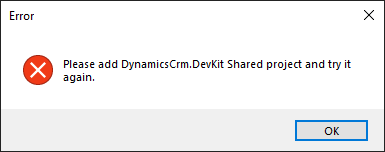

5. Add **DynamicsCrm.DevKit Shared Project** to your solution

6. Add a reference from **AccountPlugin** to the shared project. Without this reference, you'll see:

   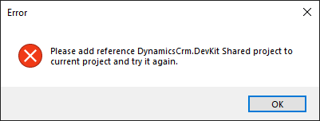

### 3.3 Install DynamicsCrm.DevKit.Cli

7. To exercise the missing CLI prompt, uninstall the CLI first:

   ```powershell
   dotnet tool uninstall -g DynamicsCrm.DevKit.Cli
   ```

8. Continue with **Add CrmPluginRegistration**. If the `devkit` command is not installed as a .NET global tool, you'll be prompted:

   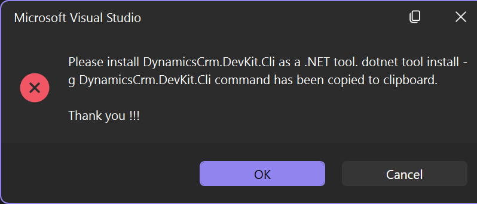

9. The install command is copied to the clipboard. Paste and run it in a terminal:

   ```powershell
   dotnet tool install -g DynamicsCrm.DevKit.Cli
   ```

   To verify the install:

   ```powershell
   devkit --version
   ```

### 3.4 Connect to Dynamics CRM/CDS

10. Run **Add CrmPluginRegistration** again. You'll be prompted to sign in:

   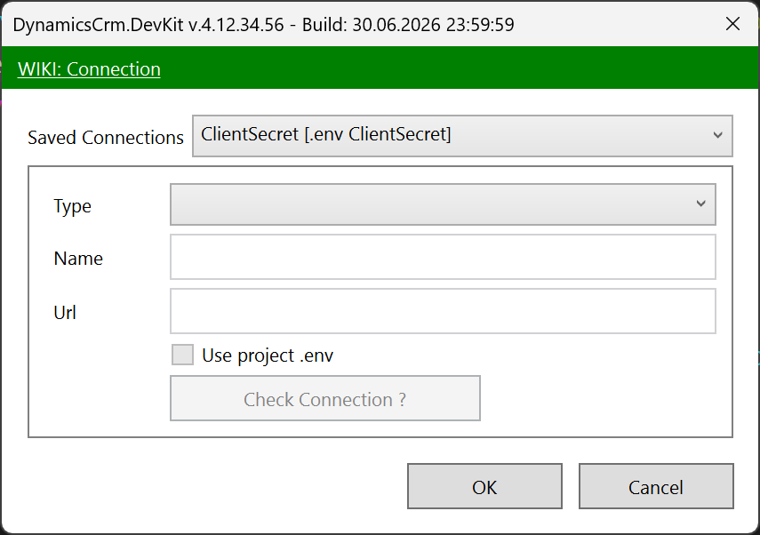

11. After signing in, DynamicsCrm.DevKit detects the existing plugin registration and adds the `CrmPluginRegistration` attribute:

    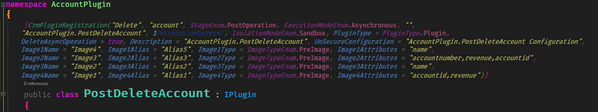

**Tip:** See the CrmPluginRegistration documentation for detailed attribute configuration options.

### 3.5 Configure CLI Settings

12. Build the solution and run `deploy.debug.bat`. You'll get an error:

    

13. Locate the new files in your solution folder:
    - `DynamicsCrm.DevKit.Cli.json`
    - `DynamicsCrm.DevKit.js`

14. Add these files to your solution as **existing items**

15. Open `DynamicsCrm.DevKit.Cli.json` and configure the **plugins** section:

    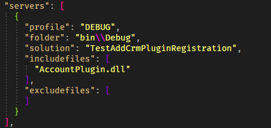

### 3.6 Deploy Your Plugin

16. Rebuild the solution and run `deploy.debug.bat`. The deployment should now succeed:

    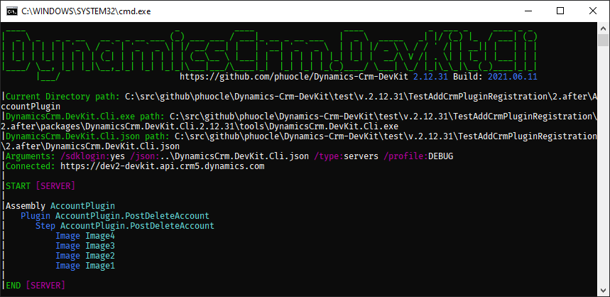

### 3.7 Handle Unregistered Steps

17. When running **Add CrmPluginRegistration** on `AccountPlugin.PostUpdateAccount`, you may see:

    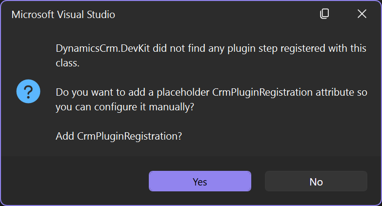

    **Solutions:**
    - Manually add the `CrmPluginRegistration` attribute (see documentation)
    - Register the step using the **Plugin Registration Tool** first, then run **Add CrmPluginRegistration**

### 3.8 Complete Plugin Conversion

18. Use **Add CrmPluginRegistration** for the remaining steps:
    - `AccountPlugin.PreAccountMergeSynchronous`
    - `AccountPlugin.PreDeleteAccount`

**Important:** Classes with **Build Action = None** (like `PreCreateAccount` or `PreUpdateAccount`) won't show the **Add CrmPluginRegistration** context menu option.

19. Deploy and verify the results:

    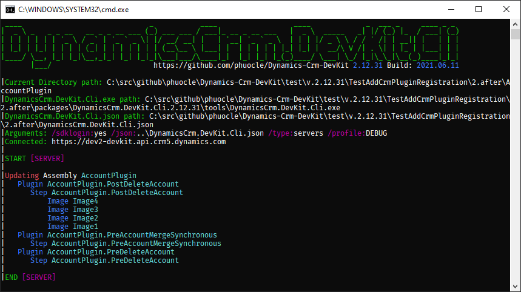

---

## Step 4: Convert Workflows

20. Open `DynamicsCrm.DevKit.Cli.json` and configure the **workflows** section for the **CustomWorkflow** project:

    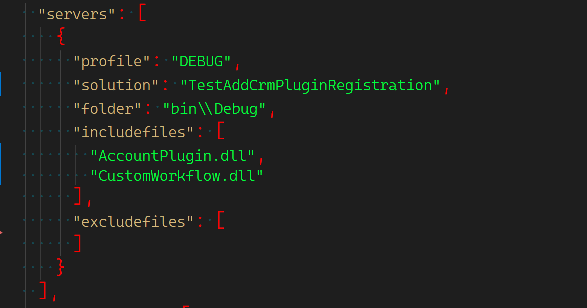

21. Run `deploy.debug.bat` to deploy:

    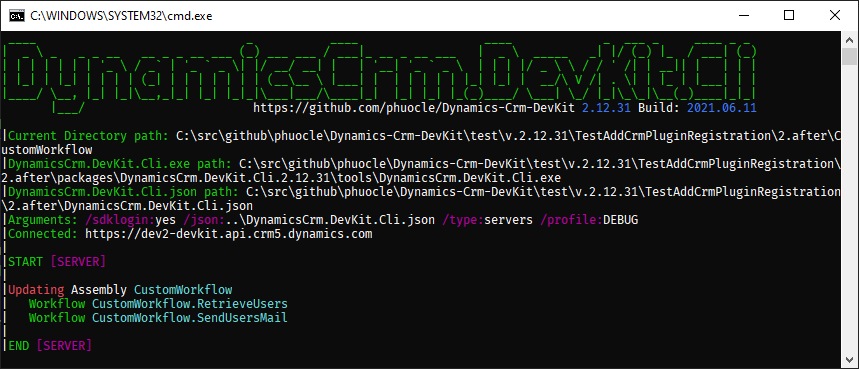

---

## Congratulations!

You have successfully converted all plugin and workflow steps to work with **DynamicsCrm.DevKit**.

### Benefits

- Automated deployment via batch files
- Source-controlled plugin registrations
- Consistent development workflow
- Easy team collaboration

---

## Additional Resources

- [DynamicsCrm.DevKit Documentation](https://github.com/phuocle/Dynamics-Crm-DevKit)
- [CrmPluginRegistration Attribute Reference](https://github.com/phuocle/Dynamics-Crm-DevKit/wiki)

---

## Folder Structure

```text
TestAddCrmPluginRegistration/
|-- 0.solution/          # Solution file to import
|-- 1.before/            # Original source code
|-- 2.after/             # Converted source code
|-- images/              # Tutorial screenshots
`-- README.md            # This guide
```
